# EMDR Therapy Mobile

### A privacy-aware mobile companion for guided bilateral-stimulation experiences, reflection, session preparation, and wellbeing workflows


> **Important:** This repository documents a software project for wellbeing and therapeutic-support workflows. It is not a substitute for a licensed mental-health professional, emergency services, or individualized clinical care. Features that involve emotionally difficult material should be designed and used with appropriate professional guidance. The application should not be represented as diagnosing, treating, curing, or preventing a medical condition unless the required clinical, regulatory, and evidentiary work has actually been completed.

---

## Table of Contents

- [1. Project Overview](#1-project-overview)
- [2. Repository Snapshot](#2-repository-snapshot)
- [3. Product Vision](#3-product-vision)
- [4. Design Principles](#4-design-principles)
- [5. User Experience Architecture](#5-user-experience-architecture)
- [6. Functional Architecture](#6-functional-architecture)
- [7. Technical Architecture](#7-technical-architecture)
- [8. Application Layering](#8-application-layering)
- [9. Navigation Architecture](#9-navigation-architecture)
- [10. Session Engine](#10-session-engine)
- [11. Bilateral Stimulation Engine](#11-bilateral-stimulation-engine)
- [12. Audio Architecture](#12-audio-architecture)
- [13. Visual Stimulation Architecture](#13-visual-stimulation-architecture)
- [14. Session State Machine](#14-session-state-machine)
- [15. Data Model](#15-data-model)
- [16. Local Persistence](#16-local-persistence)
- [17. Privacy Architecture](#17-privacy-architecture)
- [18. Safety Architecture](#18-safety-architecture)
- [19. Accessibility](#19-accessibility)
- [20. Offline-First Strategy](#20-offline-first-strategy)
- [21. Performance Engineering](#21-performance-engineering)
- [22. Error Handling](#22-error-handling)
- [23. Security Engineering](#23-security-engineering)
- [24. Testing Strategy](#24-testing-strategy)
- [25. Developer Workflow](#25-developer-workflow)
- [26. Build and Release Engineering](#26-build-and-release-engineering)
- [27. Observability](#27-observability)
- [28. API and Integration Boundaries](#28-api-and-integration-boundaries)
- [29. Recommended Project Structure](#29-recommended-project-structure)
- [30. Example TypeScript Contracts](#30-example-typescript-contracts)
- [31. Example Session Controller](#31-example-session-controller)
- [32. Example Stimulation Scheduler](#32-example-stimulation-scheduler)
- [33. Security Checklist](#33-security-checklist)
- [34. Clinical-Safety Product Boundaries](#34-clinical-safety-product-boundaries)
- [35. Threat Model](#35-threat-model)
- [36. Performance Budget](#36-performance-budget)
- [37. Accessibility Checklist](#37-accessibility-checklist)
- [38. QA Matrix](#38-qa-matrix)
- [39. Roadmap](#39-roadmap)
- [40. Contribution Guide](#40-contribution-guide)
- [41. Documentation Standards](#41-documentation-standards)
- [42. Deployment Checklist](#42-deployment-checklist)
- [43. Troubleshooting](#43-troubleshooting)
- [44. Frequently Asked Questions](#44-frequently-asked-questions)
- [45. Engineering Decisions](#45-engineering-decisions)
- [46. Future Architecture](#46-future-architecture)
- [47. Demo and Hackathon Story](#47-demo-and-hackathon-story)
- [48. Final Repository Checklist](#48-final-repository-checklist)
- [Appendix A. Mermaid Diagram Index](#appendix-a-mermaid-diagram-index)
- [Appendix B. Example Configuration](#appendix-b-example-configuration)
- [Appendix C. Release Notes Template](#appendix-c-release-notes-template)

---

# 1. Project Overview

**EMDR Therapy Mobile** is a mobile-first software project centered on calm, structured, privacy-aware wellbeing experiences and bilateral-stimulation interfaces.

The public GitHub repository currently contains a small top-level documentation surface and a packaged mobile artifact named `emdr-therapy-mobile.zip`. The current repository therefore functions partly as an artifact distribution point rather than a fully expanded source tree. The documentation below establishes a maintainable architecture for the mobile application and provides a technical baseline for continuing development.

The intended engineering goals are:

1. Create a focused mobile experience with low cognitive load.
2. Make session state deterministic and recoverable.
3. Keep sensitive user information local whenever possible.
4. Treat audio and visual stimulation as independent engines that share one timing contract.
5. Make safety controls explicit in the product architecture instead of burying them in UI copy.
6. Make the application useful in offline environments.
7. Keep integrations replaceable through interfaces rather than hard-coding vendors into screens.
8. Give contributors a predictable project structure and testing strategy.

A key architectural decision is to separate **interaction mechanics** from **clinical interpretation**. The application can orchestrate timers, animations, sounds, preferences, notes, and session metadata without making clinical judgments about a person.

---

# 2. Repository Snapshot

At the time this README was prepared, the public repository exposes the following high-level top-level assets:

```text
emdr-therapy/
├── LICENSE
├── README.md
└── emdr-therapy-mobile.zip
```

The repository reports three commits and does not currently expose a large expanded source tree at the root. The packaged mobile archive is approximately 1.66 MB according to the GitHub file view.

That distinction matters when extending the project: the architecture described in this document is the **application architecture and implementation guide**, while the ZIP archive remains the artifact that must be unpacked and inspected as the source-of-truth for exact installed dependencies, filenames, and framework versions.

### Documentation convention

Where this README says **“recommended”**, it describes an architecture choice intended to make the project easier to maintain.

Where this README says **“repository currently contains”**, it refers to the public repository snapshot.

Where this README presents TypeScript interfaces or Mermaid diagrams, those are reference contracts and diagrams that can be adopted by the application source.

---

# 3. Product Vision

The product vision is to make a calm mobile environment for structured bilateral-stimulation and reflection workflows without turning the application into an autonomous therapist.

The experience should feel closer to a **carefully engineered instrument** than a chat-heavy social application.

### Core experience

A user should be able to enter the app, understand what the current mode does, configure basic sensory preferences, begin a clearly bounded session, pause or stop immediately, and return to a neutral completion state.

The application should minimize unnecessary notifications, visual clutter, gamification, and emotional pressure.

### Product pillars

| Pillar | Goal |
|---|---|
| Calm | Reduce unnecessary cognitive load |
| Control | Make pause, stop, back, and exit obvious |
| Privacy | Prefer local processing and minimal collection |
| Reliability | Keep the session engine deterministic |
| Accessibility | Support reduced motion, captions, contrast, and touch alternatives |
| Modularity | Allow audio, animation, persistence, and analytics to evolve independently |
| Safety | Prevent the software from presenting itself as a replacement for professional care |

### Non-goals

The application should not be architected as an unsupervised autonomous psychotherapist. It should not independently diagnose a user, decide that a user has a disorder, infer hidden trauma, or initiate increasingly intense therapeutic experiences based on a private profile.

A future clinically governed product could have additional capabilities, but those capabilities should require a separate evidence, governance, safety, privacy, and regulatory program rather than being silently added to the consumer application.

---

# 4. Design Principles

## 4.1 Deterministic interactions

The same session configuration should produce a predictable execution sequence. The timer should not depend on UI renders, network latency, or animation completion callbacks.

## 4.2 One source of truth

Session state belongs in the session engine. Screens observe state; they do not independently calculate whether a session is running.

## 4.3 Side effects stay at the edge

Audio playback, haptic feedback, persistence, analytics, and native integrations are side effects. They should be behind services or adapters.

## 4.4 Privacy by default

Sensitive free-text notes should not be sent to a remote server merely because an analytics SDK exists. Local-first is the default architecture.

## 4.5 Safety controls are first-class

Pause, stop, exit, sensory reduction, and neutral reset should exist as explicit states and actions.

## 4.6 Accessibility is architectural

Reduced-motion support cannot be added only as a final UI patch. Animation engines, sound profiles, and interaction density must all be configurable.

## 4.7 Progressive enhancement

A minimum viable session should work without a network connection. Cloud features, if later added, should enrich rather than gate the core experience.

---

# 5. User Experience Architecture

A recommended information architecture is:

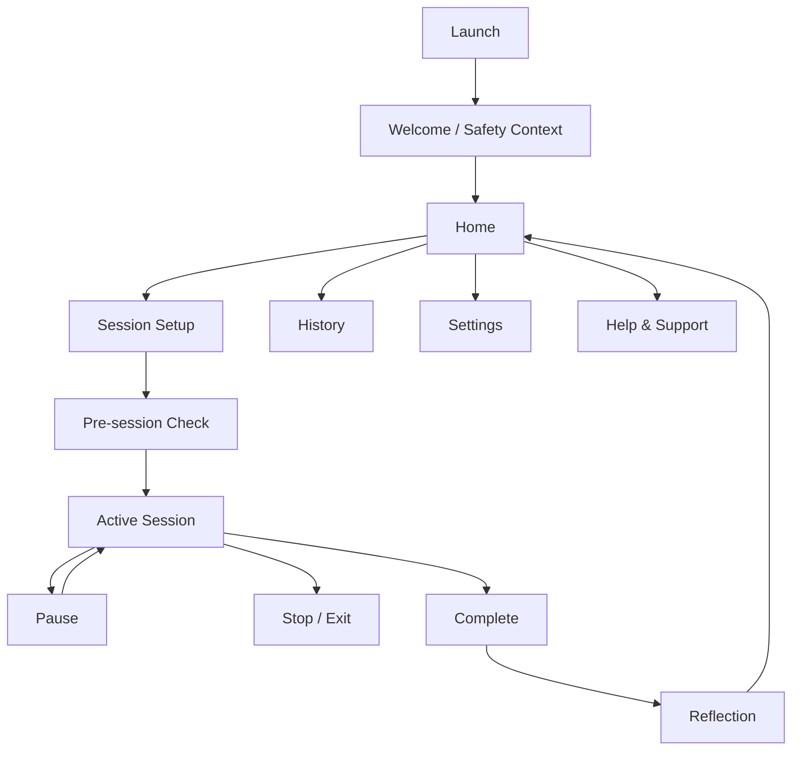

### Screen responsibilities

**Welcome / Safety Context** explains what the application is and what it is not.

**Home** is the neutral launch surface. It should avoid emotionally loaded recommendations.

**Session Setup** controls non-clinical parameters such as sensory preference, pacing, visual style, and duration where those options are supported.

**Pre-session Check** verifies readiness to continue and provides a clear route back.

**Active Session** displays only the information required for the current mode plus immediate controls.

**Pause** freezes active effects safely. It should not leave the user with an inaccessible animation running in the background.

**Complete** returns the user to a neutral state and does not automatically interpret the session.

**Reflection** can provide optional journaling or simple user-authored notes, but generated text must not be represented as a clinical conclusion.

---

# 6. Functional Architecture

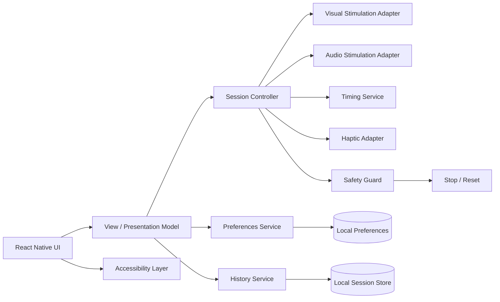

The architecture deliberately prevents a screen from directly manipulating multiple underlying engines.

For example, the session screen should issue:

```ts
sessionController.start(config);
```

rather than simultaneously calling an animation library, audio player, timer, haptic API, and database from one event handler.

That separation makes it much easier to test the application without a physical device.

---

# 7. Technical Architecture

The recommended system is organized into five primary layers.

```text
┌─────────────────────────────────────────────────────────────┐
│ Presentation Layer                                          │
│ Screens • Components • Navigation • Accessibility          │
├─────────────────────────────────────────────────────────────┤
│ Application Layer                                           │
│ Session Controller • Use Cases • Commands • Policies       │
├─────────────────────────────────────────────────────────────┤
│ Domain Layer                                                 │
│ Session • Phase • Stimulus • Preferences • Safety State     │
├─────────────────────────────────────────────────────────────┤
│ Infrastructure Layer                                        │
│ Audio • Animation • Storage • Haptics • Device APIs        │
├─────────────────────────────────────────────────────────────┤
│ Platform                                                     │
│ iOS • Android • Expo/React Native runtime                   │
└─────────────────────────────────────────────────────────────┘
```

This structure is compatible with a React Native style mobile application and does not require the UI layer to understand platform-specific APIs.

### Why this matters

Mobile APIs change more quickly than domain rules. If the session state machine is buried inside a component, replacing a package later becomes expensive. If an audio player is behind an `AudioAdapter`, the rest of the codebase does not need to know whether playback comes from one library, another library, or a native module.

---

# 8. Application Layering

The presentation layer should focus on:

- layout
- text
- buttons
- accessibility labels
- navigation
- visual state rendering

The application layer should focus on:

- starting and stopping sessions
- applying user settings
- sequencing phases
- validating transitions
- coordinating adapters

The domain layer should focus on pure data and pure transition rules.

The infrastructure layer should focus on actual side effects.

### Dependency direction

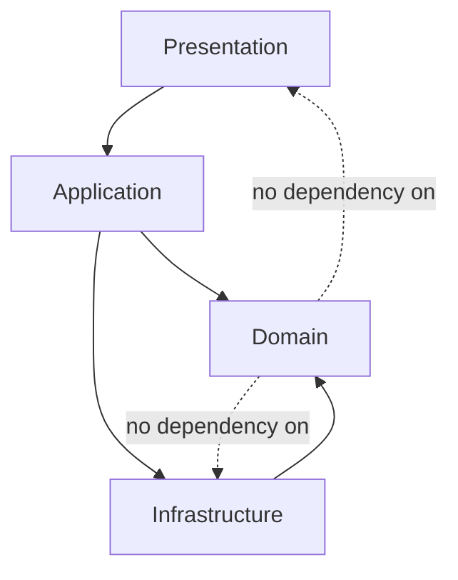

The domain must remain independently testable.

---

# 9. Navigation Architecture

A robust navigation hierarchy should keep the session flow isolated from the rest of the application.

```text
RootNavigator
├── HomeStack
│   ├── Home
│   ├── SessionSetup
│   ├── PreSession
│   ├── ActiveSession
│   ├── PauseOverlay
│   ├── Completion
│   └── Reflection
├── HistoryStack
│   ├── HistoryList
│   └── SessionDetails
├── SettingsStack
│   ├── Settings
│   ├── Accessibility
│   ├── Audio
│   └── Privacy
└── SupportStack
    ├── About
    ├── Safety
    └── Help
```

The session screen should not depend on a navigation event to stop the underlying session. The session controller must stop or pause according to explicit lifecycle handling.

### Navigation lifecycle rule

When the active session screen loses focus:

1. Determine whether background execution is intentionally supported.
2. If not, pause or stop the session.
3. Release temporary audio resources.
4. Preserve user-selected settings.
5. Never silently continue a sensory effect that the user can no longer observe or stop.

---

# 10. Session Engine

The session engine is the central orchestration component.

It should receive a declarative configuration and execute it through adapters.

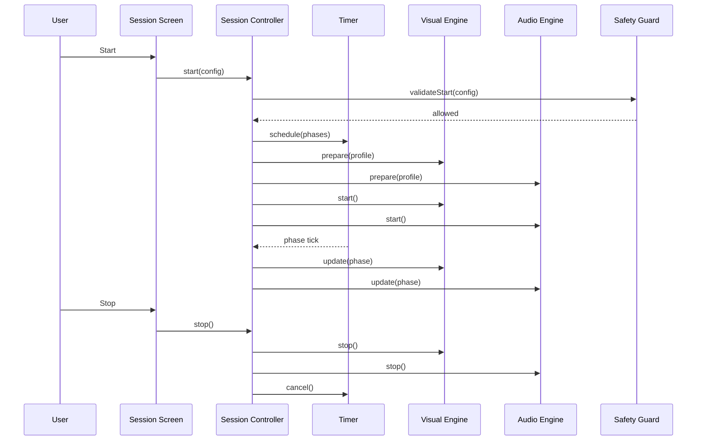

### Session engine responsibilities

The engine should:

- accept only valid configurations
- generate a session identifier
- transition through known states
- keep timer ownership centralized
- control adapters
- respond to pause and stop
- clean up resources
- emit completion metadata

The engine should not:

- render JSX
- write directly to UI component state
- classify a user's mental state
- infer clinical outcomes
- make diagnoses

---

# 11. Bilateral Stimulation Engine

The bilateral stimulation engine is a timing abstraction rather than a visual component.

### Conceptual model

```text
StimulusProfile
    │
    ├── modality: visual | audio | haptic | hybrid
    ├── direction: left-right | alternating | neutral
    ├── tempo: abstract pacing value
    ├── intensity: bounded presentation level
    └── accessibilityMode
```

The engine emits normalized events.

```ts
export type BilateralEvent = {
  sessionId: string;
  sequence: number;
  side: "left" | "right" | "center";
  at: number;
};
```

An audio adapter can consume the event and play an appropriate cue. A visual adapter can move an indicator. A haptic adapter can generate a bounded pulse.

### Important timing rule

Do not use React renders as the master clock.

Animation frames may drop. The JavaScript thread may be busy. Audio APIs may buffer. React component state may update later than the intended event.

Use a dedicated monotonic time source and schedule the next event against that time base.

---

# 12. Audio Architecture

Audio should be treated as an optional sensory channel.

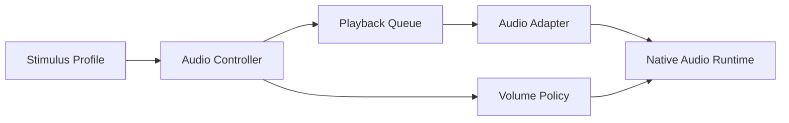

### Audio requirements

The audio system should support:

- mute
- volume scaling
- pause
- resume
- stop
- resource cleanup
- focus handling
- interruption handling
- headphones or speaker transitions where supported

### Safety-oriented defaults

The application should favor conservative audio levels and give the user immediate control. It should not dynamically increase intensity because a session has been active for a certain period.

### Audio resource lifecycle

```text
prepare()
   ↓
load()
   ↓
play()
   ↓
pause() / resume()
   ↓
stop()
   ↓
unload()
```

Never leave an audio player alive across unmounts unless that behavior is explicitly intended and thoroughly tested.

---

# 13. Visual Stimulation Architecture

Visual stimulation should be independent of navigation and business logic.

```text
VisualStimulusHost
├── DotRenderer
├── LineRenderer
├── CursorRenderer
├── AlternatingPanelRenderer
└── ReducedMotionRenderer
```

The renderer consumes normalized state:

```ts
export type VisualStimulusState = {
  progress: number;
  side: "left" | "right" | "center";
  enabled: boolean;
  reducedMotion: boolean;
};
```

### Rendering principles

1. Keep visual effects GPU-friendly where possible.
2. Avoid recreating large component trees for each stimulus event.
3. Use stable references for animation values.
4. Respect reduced-motion preferences.
5. Avoid rapid flashing patterns.
6. Ensure adequate contrast.
7. Keep the stop control visually distinct from moving content.

### Render loop separation

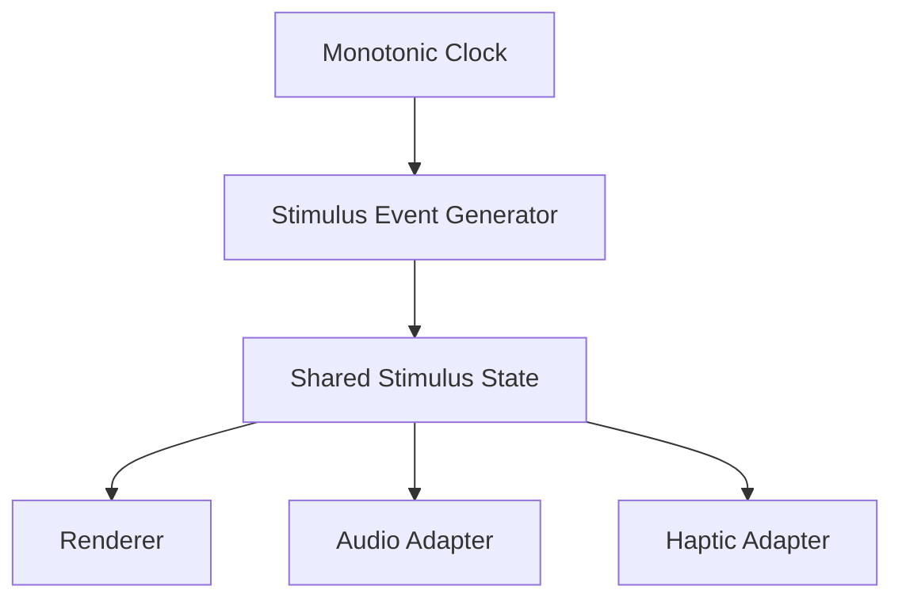

The clock and rendering loop may run at different frequencies. The state should remain authoritative.

---

# 14. Session State Machine

A session should use an explicit finite-state machine.

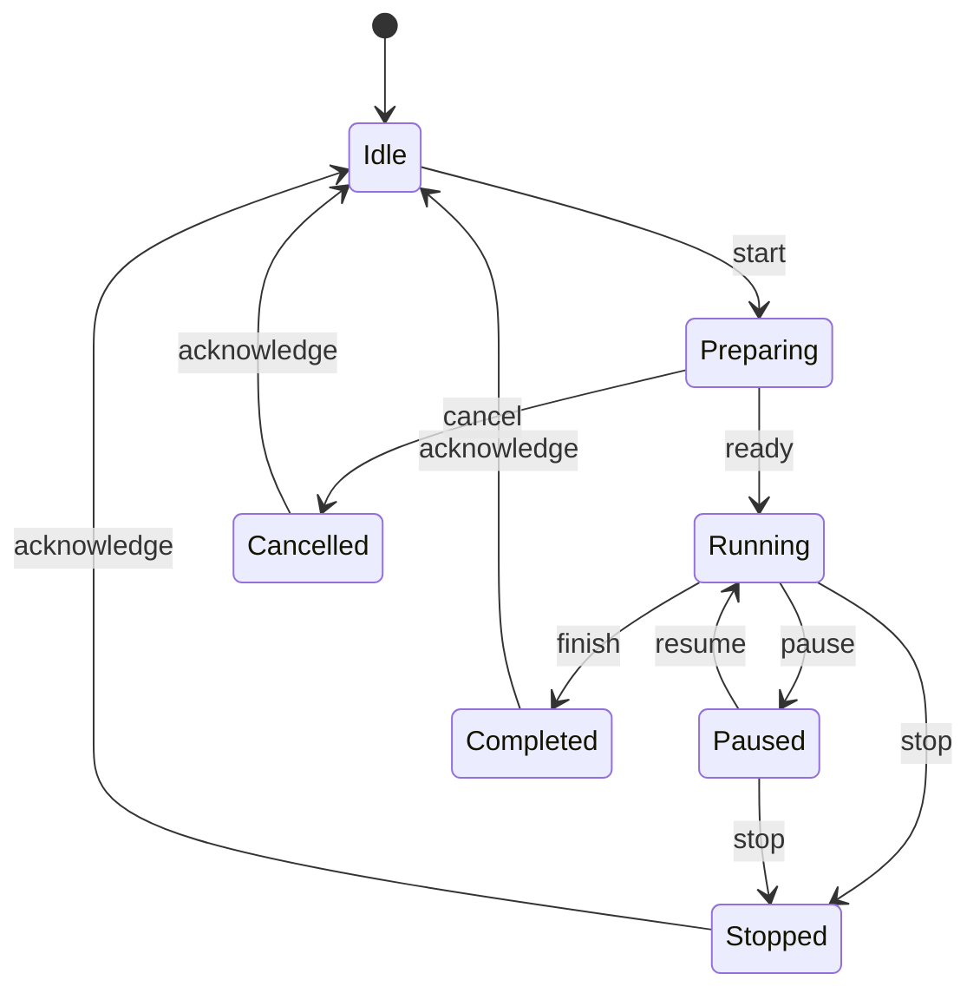

### State invariants

**Idle** has no active sensory side effects.

**Preparing** may load resources but should not begin the active effect.

**Running** owns the active session clock.

**Paused** owns no advancing phase progression.

**Completed** is terminal for that session.

**Stopped** is terminal and should release transient resources.

### Why explicit states are valuable

Without a state machine, it is easy to accidentally create impossible combinations such as:

```text
isRunning = true
isPaused = true
isCompleted = true
```

A state machine makes such conflicts structurally difficult.

---

# 15. Data Model

A minimal domain model can use the following entities.

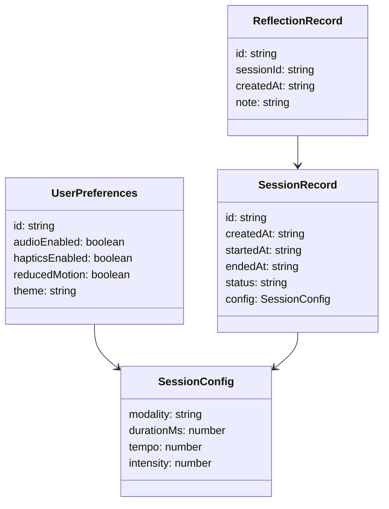

### Sensitive data classification

| Field | Sensitivity | Default storage |
|---|---|---|
| Anonymous session ID | Low | Local |
| Sensory preference | Low | Local |
| Session timestamps | Moderate | Local |
| User-authored reflection | High | Local-first |
| Clinical diagnosis | Very high | Not collected |
| Emergency information | Very high | Not collected unless a separately governed feature requires it |
| Device identifier | Moderate | Avoid unless strictly required |

The product should collect the minimum amount of data necessary for the user-visible feature.

---

# 16. Local Persistence

A local-first app can keep core state available when the network is unavailable.

Recommended storage boundaries:

```text
PreferencesStore
    └── sensory + accessibility settings

SessionStore
    └── session metadata

ReflectionStore
    └── optional user-authored notes
```

### Persistence rule

Persistence should never block the active stimulation loop.

For example, do not wait for a disk write before advancing a visual event. Record the event asynchronously, or persist only coarse session milestones.

### Data minimization

A strong baseline is to avoid storing individual stimulus events. A typical user does not need thousands of timing records retained permanently.

Store summary metadata instead:

```json
{
  "sessionId": "local-uuid",
  "startedAt": "2026-09-16T20:00:00Z",
  "endedAt": "2026-09-16T20:08:00Z",
  "status": "completed",
  "modality": "visual",
  "durationMs": 480000
}
```

---

# 17. Privacy Architecture

Privacy should be designed as a data-flow property.

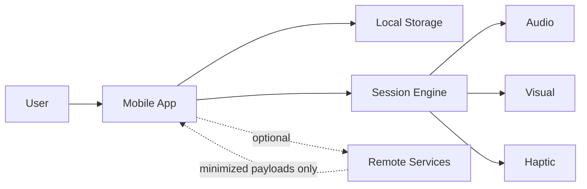

The dotted cloud path should be disabled for sensitive fields unless the user-visible feature explicitly requires remote processing and the product has appropriate privacy documentation.

### Privacy principles

- Do not send free-text reflections to analytics.
- Do not log private notes.
- Do not put sensitive values into crash breadcrumbs.
- Do not persist API keys in source code.
- Do not silently add advertising identifiers.
- Do not make remote accounts mandatory for an offline experience unless there is a compelling reason.

### Logging policy

Good:

```text
session_started
session_completed
session_stopped
```

Risky:

```text
user_note="..."
```

Never include the user's reflection content in standard logs.

---

# 18. Safety Architecture

Safety must be represented as software behavior, not only as a disclaimer.

### Immediate controls

The active session should expose:

- pause
- stop
- exit
- sensory controls where supported

These controls must remain reachable regardless of animation state.

### Neutral failure behavior

When something goes wrong, the app should prefer:

```text
stop sensory output
→ release resources
→ preserve minimal session status
→ show neutral recovery message
```

rather than attempting to recover silently while continuing stimulation.

### Content boundary

The application should avoid generating personalized clinical interpretations such as:

- diagnostic labels
- trauma classifications
- claims that a memory has been therapeutically processed
- claims that a symptom has been treated
- predictions of psychological outcomes

A reflection assistant, if added later, should be explicitly framed as organizational or educational support rather than as a therapist.

---

# 19. Accessibility

Accessibility is central because sensory interfaces can affect users differently.

### Required settings

```text
Reduced Motion      ON / OFF
Audio               ON / OFF
Haptics             ON / OFF
Text Size           system / expanded
High Contrast       system / enhanced
Captions            when spoken content exists
```

### Reduced-motion architecture

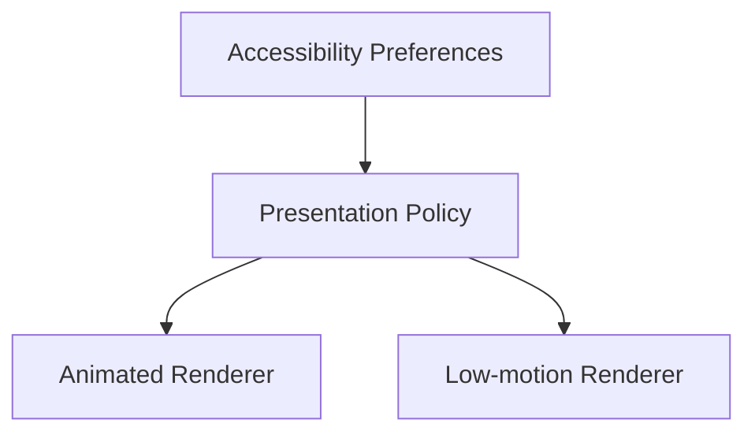

Reduced motion should not simply hide the content; it should provide a usable alternate presentation.

### Touch target guidance

Controls should have comfortably sized touch targets and should not rely on tiny icons alone.

### Screen readers

Every active control should have a meaningful accessibility label.

For example:

```tsx
<Button
  accessibilityRole="button"
  accessibilityLabel="Stop session"
  accessibilityHint="Ends the current session and returns to a neutral state"
/>
```

---

# 20. Offline-First Strategy

The core session flow should be functional without network connectivity.

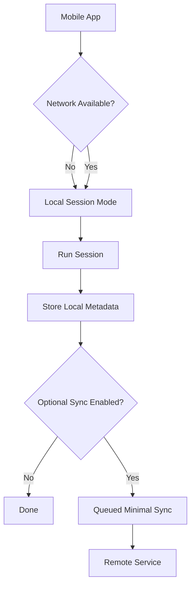

### Offline requirements

- no remote authentication for basic use, if the product design allows it
- no remote call required to start a session
- local preferences available immediately
- local session state recoverable after transient failure
- graceful behavior when audio assets are unavailable

### Network-aware UX

Avoid a blocking full-screen “No Internet” message when the feature does not need the network.

---

# 21. Performance Engineering

The most performance-sensitive components are likely to be:

1. animation
2. audio timing
3. navigation transitions
4. local storage writes
5. large history lists

### Performance rule

A stimulus tick should not trigger a full React tree render.

Use stable animated values where the chosen rendering stack supports them.

### Example anti-pattern

```tsx
const [position, setPosition] = useState(0);

setInterval(() => {
  setPosition((p) => p + 1);
}, 16);
```

This can create unnecessary render pressure.

### Better boundary

```text
Clock
  ↓
Animation value
  ↓
Native/GPU-friendly renderer
```

### Cleanup requirement

Every timer created by the session controller must have a corresponding cancellation path.

```text
start() → timer created
pause() → timer paused/cancelled
stop() → timer cancelled
unmount() → timer cancelled
error() → timer cancelled
```

---

# 22. Error Handling

Errors should be modeled by category.

| Category | Example | Recovery |
|---|---|---|
| Configuration | Invalid duration | Reject before start |
| Platform | Audio unavailable | Fall back to visual-only mode |
| Lifecycle | App backgrounded | Pause/stop safely |
| Storage | Write failure | Continue session; report non-blocking status |
| Rendering | Animation failure | Switch to reduced renderer |
| Network | Timeout | Continue offline if possible |
| Permission | Sensor/audio permission denied | Offer alternate mode |

### Error boundary

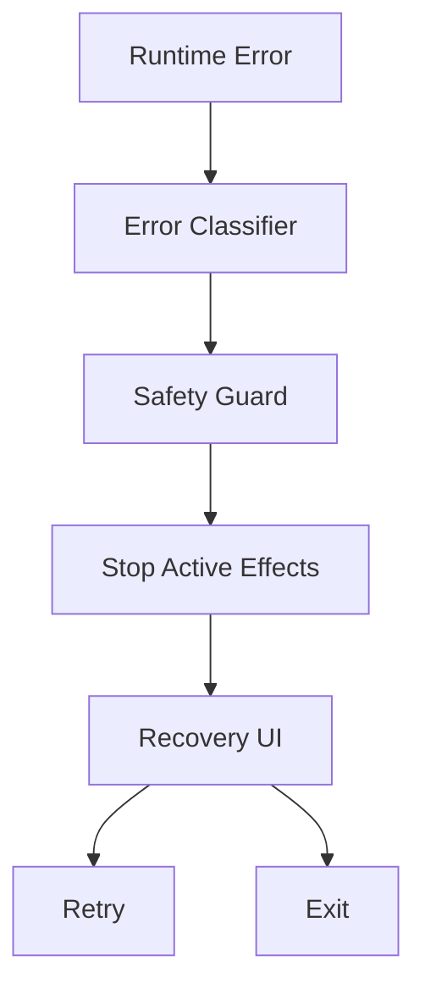

Do not let an exception in a secondary subsystem keep the primary session in an uncertain state.

---

# 23. Security Engineering

Security requirements include:

- no hard-coded secrets
- no private tokens in source control
- dependency review
- sanitized logs
- safe deep-link handling
- secure local storage for secrets if secrets are ever introduced
- explicit permission requests
- minimal network permissions

### Threat-sensitive fields

User reflections and other personal notes should be treated as sensitive, even if they are not classified as medical records by the application's legal architecture.

### Secure configuration

Use environment variables or build-time secret injection for API keys.

Never do this:

```ts
const API_KEY = "sk-live-example";
```

Prefer configuration injection:

```ts
const API_KEY = process.env.EXAMPLE_API_KEY;
```

Even then, do not put a server secret into a client application. Client applications should use scoped, public, or short-lived credentials appropriate to the service.

---

# 24. Testing Strategy

Testing should happen at four levels.

```text
Unit Tests
   ↓
Domain / Session Tests
   ↓
Integration Tests
   ↓
Device / E2E Tests
```

### Unit tests

Test pure helpers:

- phase validation
- duration conversion
- transition guards
- configuration normalization
- accessibility policy selection

### Session tests

Test the state machine:

```text
idle → preparing → running → completed
idle → preparing → cancelled
running → paused → running
running → stopped
paused → stopped
```

### Integration tests

Test that the controller coordinates adapters correctly.

### E2E tests

Test:

- launch
- configure
- start
- pause
- resume
- stop
- completion
- accessibility settings

### Regression target

The most important regression is accidental continued stimulation after the user believes the session has stopped.

---

# 25. Developer Workflow

Recommended workflow:

```text
Issue
  ↓
Architecture note
  ↓
Implementation
  ↓
Unit tests
  ↓
Device test
  ↓
Accessibility check
  ↓
Security check
  ↓
Pull request
  ↓
Release
```

### Branch naming

```text
feature/session-state-machine
feature/accessibility-controls
fix/audio-cleanup
fix/session-stop-race
chore/dependency-update
```

### Commit style

```text
feat: add session controller
fix: stop audio when session ends
refactor: isolate storage adapter
test: cover pause and resume transitions
docs: expand architecture guide
```

### Definition of done

A feature is not done until:

- behavior works on a target device
- cleanup paths are covered
- accessibility behavior is tested
- private data is not leaked into logs
- failure behavior has a defined result
- documentation is updated

---

# 26. Build and Release Engineering

The mobile artifact should be buildable from a clean environment.

A typical React Native / Expo-style workflow is conceptually:

```bash
npm install
npm run start
```

Platform-specific commands depend on the framework configuration contained in the packaged mobile source. The exact commands should be confirmed from the extracted project's `package.json` before publishing release instructions.

### Pre-release matrix

| Check | iOS | Android | Web, if supported |
|---|---:|---:|---:|
| App launch | ✓ | ✓ | Optional |
| Session start | ✓ | ✓ | Optional |
| Pause/stop | ✓ | ✓ | Optional |
| Audio | ✓ | ✓ | Optional |
| Reduced motion | ✓ | ✓ | Optional |
| Persistence | ✓ | ✓ | Optional |
| Rotation/layout | ✓ | ✓ | Optional |

### Release channels

Recommended channels:

```text
development
preview
production
```

Keep production builds immutable and traceable to a commit.

---

# 27. Observability

Observability should be useful without becoming surveillance.

### Safe event taxonomy

```text
app_opened
session_setup_opened
session_started
session_paused
session_resumed
session_stopped
session_completed
settings_changed
```

Avoid capturing:

- reflection text
- trauma narratives
- diagnosis-like data
- emotionally sensitive free text
- exact detailed stimulus streams unless required for a narrowly defined engineering purpose

### Debug logging

Development logging may include internal identifiers but must remain sanitized.

```ts
logger.debug("session.transition", {
  from: previousState,
  to: nextState,
});
```

Do not log complete state objects if they may contain user-authored notes.

---

# 28. API and Integration Boundaries

Even if the first version is entirely local, define integration boundaries early.

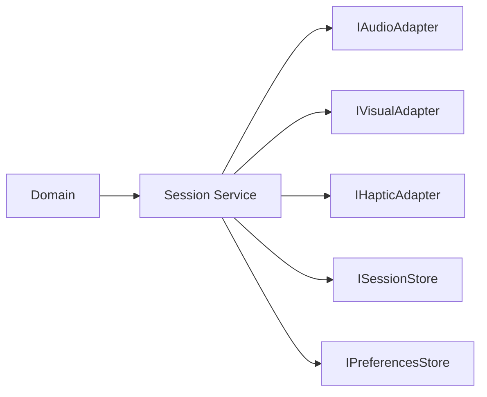

### Adapter example

```ts
export interface AudioAdapter {
  prepare(profile: AudioProfile): Promise<void>;
  play(): Promise<void>;
  pause(): Promise<void>;
  stop(): Promise<void>;
  dispose(): Promise<void>;
}
```

The session controller should depend on the interface rather than a specific third-party package.

This makes vendor replacement substantially cheaper.

---

# 29. Recommended Project Structure

A maintainable React Native structure could look like:

```text
src/
├── app/
│   ├── navigation/
│   ├── providers/
│   └── bootstrap/
├── screens/
│   ├── Home/
│   ├── SessionSetup/
│   ├── ActiveSession/
│   ├── Completion/
│   ├── History/
│   ├── Settings/
│   └── Support/
├── components/
│   ├── Button/
│   ├── Card/
│   ├── Modal/
│   └── Stimulus/
├── domain/
│   ├── session/
│   ├── stimulus/
│   ├── preferences/
│   └── safety/
├── services/
│   ├── session/
│   ├── audio/
│   ├── visual/
│   ├── haptics/
│   ├── storage/
│   └── analytics/
├── state/
├── hooks/
├── theme/
├── utils/
└── types/
```

The exact source tree should follow the extracted application's current conventions rather than forcing a large rewrite solely for documentation symmetry.

---

# 30. Example TypeScript Contracts

## Session configuration

```ts
export type SessionModality = "visual" | "audio" | "haptic" | "hybrid";

export interface SessionConfig {
  modality: SessionModality;
  durationMs: number;
  tempo: number;
  intensity: number;
  audioEnabled: boolean;
  hapticsEnabled: boolean;
  reducedMotion: boolean;
}
```

## Session state

```ts
export type SessionStatus =
  | "idle"
  | "preparing"
  | "running"
  | "paused"
  | "completed"
  | "stopped";

export interface SessionState {
  sessionId: string | null;
  status: SessionStatus;
  startedAt: number | null;
  elapsedMs: number;
  remainingMs: number;
  sequence: number;
}
```

## Session controller

```ts
export interface SessionController {
  start(config: SessionConfig): Promise<void>;
  pause(): Promise<void>;
  resume(): Promise<void>;
  stop(reason?: string): Promise<void>;
  getState(): SessionState;
}
```

These contracts are intentionally small. The smaller the central interface, the easier it is to test and replace dependencies.

---

# 31. Example Session Controller

A reference implementation can follow this shape:

```ts
class DefaultSessionController implements SessionController {
  private state: SessionState = {
    sessionId: null,
    status: "idle",
    startedAt: null,
    elapsedMs: 0,
    remainingMs: 0,
    sequence: 0,
  };

  constructor(
    private readonly clock: Clock,
    private readonly timer: SessionTimer,
    private readonly audio: AudioAdapter,
    private readonly visual: VisualAdapter,
    private readonly safety: SafetyGuard,
  ) {}

  async start(config: SessionConfig): Promise<void> {
    this.safety.assertStartAllowed(config);

    if (this.state.status !== "idle") {
      throw new Error("Session is not idle");
    }

    this.state = {
      ...this.state,
      sessionId: crypto.randomUUID(),
      status: "preparing",
      startedAt: this.clock.now(),
      elapsedMs: 0,
      remainingMs: config.durationMs,
      sequence: 0,
    };

    try {
      await this.visual.prepare(config);
      if (config.audioEnabled) await this.audio.prepare(config);

      this.state = { ...this.state, status: "running" };
      await this.visual.start(config);
      if (config.audioEnabled) await this.audio.play();

      this.timer.start(config.durationMs, () => this.complete());
    } catch (error) {
      await this.stop("start_error");
      throw error;
    }
  }

  async pause(): Promise<void> {
    if (this.state.status !== "running") return;

    this.timer.pause();
    await this.visual.pause();
    await this.audio.pause();
    this.state = { ...this.state, status: "paused" };
  }

  async resume(): Promise<void> {
    if (this.state.status !== "paused") return;

    this.timer.resume();
    await this.visual.resume();
    await this.audio.play();
    this.state = { ...this.state, status: "running" };
  }

  async stop(reason = "user_stop"): Promise<void> {
    this.timer.cancel();
    await Promise.allSettled([
      this.visual.stop(),
      this.audio.stop(),
      this.audio.dispose(),
      this.visual.dispose(),
    ]);

    this.state = {
      ...this.state,
      status: "stopped",
    };

    void reason;
  }

  private async complete(): Promise<void> {
    if (this.state.status !== "running") return;

    await Promise.allSettled([
      this.visual.stop(),
      this.audio.stop(),
    ]);

    this.state = {
      ...this.state,
      status: "completed",
    };
  }

  getState(): SessionState {
    return this.state;
  }
}
```

The production implementation should adapt this pattern to the project's actual runtime, native APIs, and state-management library.

---

# 32. Example Stimulation Scheduler

A scheduler should use monotonic time rather than assuming every callback occurs precisely on schedule.

```ts
export interface Clock {
  now(): number;
}

export interface StimulusScheduler {
  start(intervalMs: number, onTick: (sequence: number) => void): void;
  stop(): void;
}

export class MonotonicStimulusScheduler implements StimulusScheduler {
  private timer: ReturnType<typeof setTimeout> | null = null;
  private running = false;
  private sequence = 0;

  start(intervalMs: number, onTick: (sequence: number) => void): void {
    this.stop();
    this.running = true;
    this.sequence = 0;

    const schedule = () => {
      if (!this.running) return;

      onTick(this.sequence++);
      this.timer = setTimeout(schedule, intervalMs);
    };

    schedule();
  }

  stop(): void {
    this.running = false;
    if (this.timer) clearTimeout(this.timer);
    this.timer = null;
  }
}
```

For high-precision implementations, a platform-native or frame-synchronized timing mechanism can be substituted behind the same interface.

---

# 33. Security Checklist

Before every production build:

```text
[ ] No secrets committed
[ ] No sensitive logs
[ ] No user notes in analytics
[ ] Dependencies audited
[ ] Release build reproducible
[ ] Deep links validated
[ ] Permissions minimized
[ ] Local storage reviewed
[ ] Error messages do not expose internals
[ ] Network requests use TLS
[ ] Remote API authorization reviewed
[ ] Crash reporting configured to redact sensitive payloads
```

### Secret scanning

Recommended tooling can include repository-native secret scanning plus a local pre-commit check.

### Dependency hygiene

Use the package manager's supported audit mechanisms and review transitive packages that touch:

- storage
- networking
- audio
- native modules
- authentication

Dependency updates should be tested on both major mobile platforms before release.

---

# 34. Clinical-Safety Product Boundaries

This section is deliberately explicit because the domain is sensitive.

## The application can safely be documented as software support when it focuses on

- user-controlled sensory settings
- timers
- visual movement interfaces
- optional audio cues
- session tracking
- personal settings
- journaling that remains under the user's control
- educational information with appropriate sourcing

## The application should not silently claim

- that it has diagnosed a disorder
- that a user's symptoms prove a particular condition
- that a specific session cured trauma
- that a memory is therapeutically resolved
- that the application replaces a therapist
- that an AI component is a licensed clinician

### Clinical governance boundary

If the project ever becomes a regulated digital therapeutic or clinical device, the architecture needs a separate program covering evidence, human oversight, risk management, privacy, security, validation, documentation, and applicable regulations. That is a product-development change, not merely a README change.

---

# 35. Threat Model

A lightweight threat model helps prioritize protection.

| Threat | Impact | Mitigation |
|---|---|---|
| Sensitive notes leaked in logs | High | Redact logs |
| Session continues after stop | High | Centralized stop path + tests |
| API key extracted from client | High | Never ship server secrets |
| Compromised dependency | High | Audit and pin ranges appropriately |
| Unauthorized cloud access | High | Strong auth + least privilege |
| Accidental data retention | Medium | Data-minimization policy |
| Accessibility failure | Medium | Automated + manual accessibility checks |
| Audio keeps playing after unmount | Medium | Lifecycle cleanup |
| Corrupted local record | Low/Medium | Schema validation + graceful migration |

### Abuse-resistant architecture

The application should not store enough sensitive information to become a high-value repository by default.

This is an example of **security through data minimization**, not merely security through encryption.

---

# 36. Performance Budget

A practical starting budget:

| Area | Target |
|---|---|
| Cold launch | Keep responsive on supported test devices |
| Idle memory | Avoid continuously growing allocations |
| Session animation | Stable frame delivery on target hardware |
| Audio | No audible clipping or repeated resource leaks |
| History screen | Virtualized list for large records |
| Persistence | Asynchronous, non-blocking |
| Network | Never required for core local session |

### Performance instrumentation

Use profiling builds to inspect:

- JS thread activity
- UI thread/frame time
- memory allocation
- audio initialization latency
- screen transition cost

Do not optimize by removing safety controls or accessibility features.

---

# 37. Accessibility Checklist

```text
[ ] Every control has an accessible name
[ ] Stop is available without precision gestures
[ ] Reduced motion changes the rendering strategy
[ ] Audio can be disabled
[ ] Haptics can be disabled
[ ] Text follows user/system scaling where practical
[ ] Contrast meets the project's accessibility target
[ ] Focus order is logical
[ ] Error messages are readable by assistive technology
[ ] No function depends solely on animation
[ ] No function depends solely on color
[ ] Session completion is announced appropriately
```

### Reduced-motion example

```ts
function getStimulusRenderer(settings: AccessibilitySettings) {
  return settings.reducedMotion
    ? reducedMotionRenderer
    : standardRenderer;
}
```

The key point is to make accessibility a dependency of the renderer rather than a separate afterthought screen.

---

# 38. QA Matrix

A full QA matrix should include:

| Scenario | Expected |
|---|---|
| Start session | Preparation then running |
| Double-tap start | Only one active session |
| Pause | Timer and sensory output stop advancing |
| Resume | Session continues from paused state |
| Stop | All output stops immediately |
| Back navigation | Defined safe behavior |
| App background | Defined pause/stop behavior |
| Audio unavailable | Defined fallback |
| Storage failure | Core session remains usable |
| Reduced motion | Alternate renderer used |
| Screen reader | Controls remain understandable |
| Device rotation | Layout remains usable |
| Low battery | No uncontrolled background work |
| Network loss | Core local session continues |
| App crash | Next launch starts in a safe neutral state |

### Race-condition tests

Explicitly test:

```text
stop() during start()
stop() during pause()
resume() after stop()
start() during completion()
background() during running()
unmount() during active timer
```

The goal is to make every race end in a known safe state.

---

# 39. Roadmap

## Phase 1 — Foundation

- establish source tree
- define session state machine
- centralize timing
- build adapter interfaces
- add local preferences
- establish accessibility baseline

## Phase 2 — Sensory engine

- visual stimulus renderer
- audio adapter
- haptic adapter where appropriate
- robust pause/stop behavior

## Phase 3 — Privacy and reliability

- secure local persistence
- log redaction
- error boundaries
- offline-first support
- recovery flows

## Phase 4 — Product polish

- refined navigation
- dark/light theme support
- richer accessibility
- performance profiling
- device QA matrix

## Phase 5 — Optional services

- optional remote backup
- controlled account system
- privacy documentation
- server-side telemetry with strict minimization

## Phase 6 — Governance

If clinical claims or regulated use are ever considered, establish a dedicated clinical/product safety program before implementing such functionality.

---

# 40. Contribution Guide

Contributors should keep changes focused.

### Pull request template

```md
## What changed?

Describe the change.

## Why?

Describe the user or engineering problem.

## Safety impact

Describe whether the change affects session behavior, sensory output, privacy, or accessibility.

## Testing

- [ ] Unit tests
- [ ] Integration tests
- [ ] Device test
- [ ] Accessibility check

## Screenshots / recordings

Attach relevant media.
```

### Review priorities

Reviewers should pay particular attention to:

1. session lifecycle
2. data handling
3. accessibility
4. cleanup behavior
5. platform differences

---

# 41. Documentation Standards

Every meaningful subsystem should have:

- purpose
- inputs
- outputs
- lifecycle
- failure behavior
- privacy implications
- accessibility implications
- tests

### Architecture Decision Records

Recommended filenames:

```text
docs/adr/001-local-first-data.md
docs/adr/002-session-state-machine.md
docs/adr/003-audio-adapter.md
docs/adr/004-reduced-motion.md
```

An ADR should answer:

```text
Context
Decision
Alternatives
Consequences
Validation
```

---

# 42. Deployment Checklist

Before publishing:

```text
[ ] Version number updated
[ ] Changelog updated
[ ] App metadata reviewed
[ ] Privacy documentation reviewed
[ ] Permission descriptions reviewed
[ ] Crash reporting redaction verified
[ ] Production API endpoints verified
[ ] Development endpoints removed
[ ] Debug logging disabled
[ ] Session stop tested on real devices
[ ] Audio cleanup tested
[ ] Accessibility tested
[ ] Offline mode tested
[ ] Store assets updated
[ ] Release commit tagged
```

### Reproducibility

Every production artifact should map to:

```text
Git commit
+ dependency lockfile
+ build configuration
+ release environment
```

That makes future debugging possible.

---

# 43. Troubleshooting

## The active session does not stop

Check that the stop button calls the session controller rather than only changing UI state.

The expected path is:

```text
UI → Controller.stop() → Timer.cancel()
                    → Visual.stop()
                    → Audio.stop()
                    → Resource disposal
```

## Audio continues after navigation

Check lifecycle cleanup and verify that a screen unmount does not leave an active audio object.

## Animation stutters

Inspect render frequency and determine whether React state updates are triggering a full component tree render.

## Session restarts unexpectedly

Inspect duplicate `start()` calls and focus/lifecycle effects.

## Offline startup fails

Verify that the core startup path does not await remote configuration before entering the application shell.

## History becomes slow

Use a virtualized list, paginate or summarize history, and avoid reading every record into memory at once.

---

# 44. Frequently Asked Questions

## Is this a replacement for a therapist?

No. The software should be documented as a mobile wellbeing/therapy-support interface unless the product has the evidence, oversight, regulatory position, and clinical governance required for stronger claims.

## Does the app need internet access?

The recommended architecture does not require a network connection for the core local session flow.

## Why use adapters?

Adapters isolate platform and vendor-specific APIs from the session engine.

## Why is the timer centralized?

Because multiple UI components and side effects should never maintain competing clocks.

## Why is reduced motion part of the architecture?

Because visual pacing is a core part of the experience and needs a safe alternate renderer.

## Why avoid storing detailed stimulation events?

They generally add sensitive data without creating proportionate user value.

## Can the application add AI?

Technically yes, but AI should remain bounded and transparent. An AI feature must not silently become a clinical decision-maker or imply professional licensure.

---

# 45. Engineering Decisions

## Decision 1 — Domain-first session state

**Decision:** Keep session transitions independent from UI components.

**Reason:** It improves testability and lifecycle correctness.

## Decision 2 — Adapter-based sensory channels

**Decision:** Visual, audio, and haptic output use interfaces.

**Reason:** Allows replacement of libraries and platform APIs.

## Decision 3 — Local-first storage

**Decision:** Keep core preferences and session metadata local by default.

**Reason:** Supports offline use and limits sensitive data transfer.

## Decision 4 — Explicit safety state

**Decision:** Stop and pause are first-class transitions.

**Reason:** Safety should not depend on UI conventions.

## Decision 5 — No hidden autonomous therapy layer

**Decision:** The application remains a software instrument unless a separately governed clinical program is established.

**Reason:** Technical functionality and clinical efficacy are different claims.

---

# 46. Future Architecture

A future expanded platform could look like:

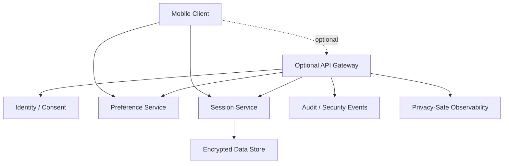

The cloud should be optional for core experiences.

### Future AI boundary

If a future assistant is introduced:

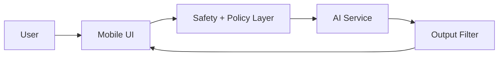

The policy layer should be able to refuse unsupported clinical actions and keep the assistant within its documented role.

---

# 47. Demo and Hackathon Story

For demonstrations, the strongest technical story is not simply “an app that moves a dot.” The story is the architecture that makes the experience reliable.

### Suggested demo sequence

```text
1. Open app
2. Explain privacy/local-first model
3. Show accessibility controls
4. Open session setup
5. Start controlled visual experience
6. Pause
7. Change sensory preferences
8. Resume or stop
9. Show completion state
10. Show local session history
11. Explain adapter architecture
12. Show Mermaid system diagram
```

### Demo talking points

**Deterministic:** One state machine controls the session.

**Modular:** Visual and audio engines are independent adapters.

**Private:** Sensitive content is not required to run the core experience.

**Accessible:** Reduced motion and sensory controls are part of the architecture.

**Offline-ready:** The essential workflow does not need a cloud connection.

The demo should avoid presenting the product as a proven clinical treatment merely because it contains a therapy-related interface.

---

# 48. Final Repository Checklist

Before calling the repository release-ready:

```text
Repository
[ ] Expanded source is committed or distributed clearly
[ ] README is current
[ ] License is present
[ ] .gitignore is present
[ ] package manager lockfile is present

Architecture
[ ] Session controller exists
[ ] State machine is tested
[ ] Timing is centralized
[ ] Sensory adapters are isolated

Privacy
[ ] Logs are sanitized
[ ] Sensitive notes remain local by default
[ ] No credentials are committed

Accessibility
[ ] Reduced motion works
[ ] Audio can be disabled
[ ] Haptics can be disabled
[ ] Screen-reader labels exist

Reliability
[ ] Stop always stops
[ ] Background lifecycle is defined
[ ] Errors clean up resources
[ ] Offline flow works

Release
[ ] Production configuration verified
[ ] Device builds tested
[ ] Version tagged
[ ] Changelog updated
```

---

# Appendix A. Mermaid Diagram Index

This README intentionally uses Mermaid so the architecture remains editable in GitHub-compatible documentation systems.

### System layers

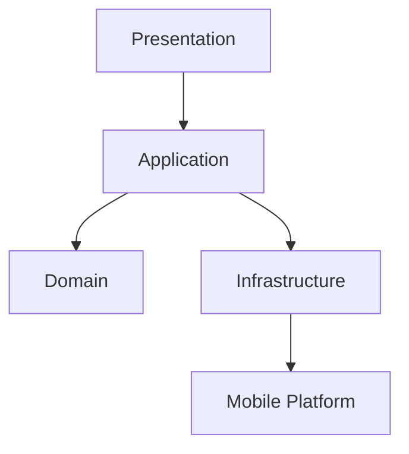

### Session lifecycle

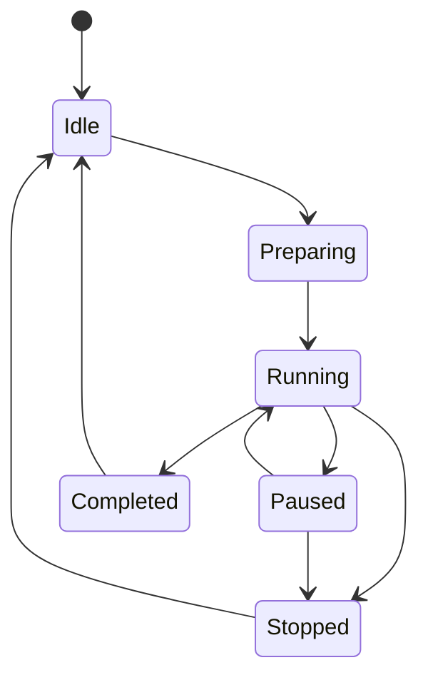

### Privacy flow

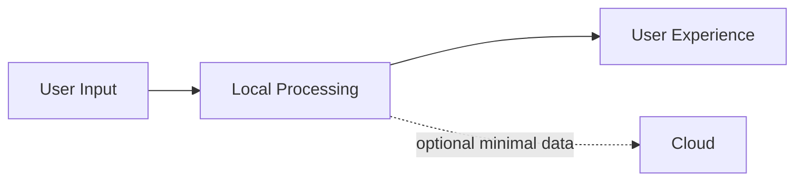

---

# Appendix B. Example Configuration

A normalized configuration object may look like this:

```ts
export const defaultSessionConfig: SessionConfig = {
  modality: "visual",
  durationMs: 5 * 60 * 1000,
  tempo: 1,
  intensity: 0,
  audioEnabled: false,
  hapticsEnabled: false,
  reducedMotion: false,
};
```

The exact defaults should be chosen by product and safety review rather than treated as clinically prescribed values.

### Environment variables

A future environment configuration could use:

```bash
APP_ENV=development
API_BASE_URL=https://example.invalid
PUBLIC_APP_VERSION=0.1.0
```

Never put confidential server credentials into a mobile application's public environment variables.

---

# Appendix C. Release Notes Template

```md
# Release X.Y.Z

## Highlights

- Added ...
- Improved ...
- Fixed ...

## Safety & Privacy

- ...

## Accessibility

- ...

## Performance

- ...

## Testing

- iOS: ...
- Android: ...

## Known Limitations

- ...

## Upgrade Notes

- ...
```

---

# Architecture Summary

The intended architecture can be summarized in one diagram:

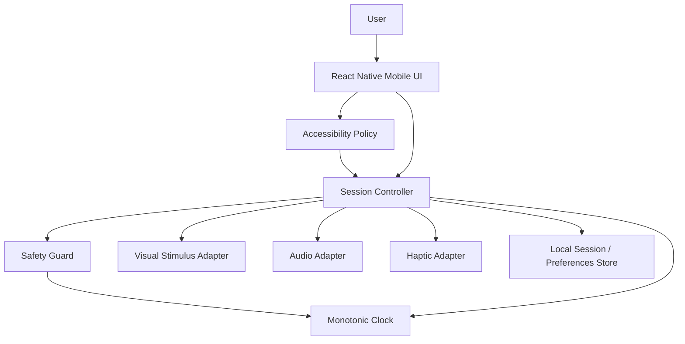

The critical invariant is simple:

> **The UI describes intent. The session controller owns execution. The domain owns rules. Infrastructure owns side effects. Safety owns the stop path.**

That separation gives the project room to evolve without turning every new feature into a rewrite of the core session experience.

---

# License

This project includes an MIT license in the repository. See [`LICENSE`](./LICENSE) for the authoritative license text.

# Repository

GitHub: `https://github.com/lucylow/emdr-therapy`

---

## Maintainer Notes

The repository currently distributes the mobile application as `emdr-therapy-mobile.zip`. For future releases, consider committing an expanded source tree or adding a dedicated `docs/` directory so architecture documentation, ADRs, test plans, and implementation notes can evolve alongside the source code.

For exact framework versions, package names, file paths, and native configuration, treat the extracted mobile archive as the source of truth and update this README whenever those implementation details change.
