# Quantum ROI Business

## Optimization & Quantum Readiness Decision Lab

A mobile-first enterprise optimization laboratory that starts with a real business decision, establishes a classical baseline, explores optimization strategies, translates results into business value, and exposes a quantum-ready mathematical formulation when a quantum experiment is technically appropriate.

> **Important:** Quantum ROI Business is an independent research/product prototype. It is not an enterprise or cloud provider product, does not contain enterprise internal data, and does not claim endorsement by enterprise, cloud provider, or any individual mentioned in the source material.
>
> All numbers shown in the demo UI are **synthetic demonstration data** unless explicitly connected to a customer-owned production system.

---

## Table of Contents

1. [Executive Overview](#1-executive-overview)
2. [Why This Product Exists](#2-why-this-product-exists)
3. [Source-Grounded Product Philosophy](#3-source-grounded-product-philosophy)
4. [Core Product Experience](#4-core-product-experience)
5. [Design System & UX Architecture](#5-design-system--ux-architecture)
6. [System Architecture](#6-system-architecture)
7. [Repository Structure](#7-repository-structure)
8. [Technology Stack](#8-technology-stack)
9. [Domain Model](#9-domain-model)
10. [Business Problem Catalog](#10-business-problem-catalog)
11. [Optimization Engine](#11-optimization-engine)
12. [Random-Key Optimization](#12-random-key-optimization)
13. [Classical Baselines & Benchmarking](#13-classical-baselines--benchmarking)
14. [QUBO Formulation](#14-qubo-formulation)
15. [QUBO to Ising Conversion](#15-qubo-to-ising-conversion)
16. [Kernel Reduction & Quantum Readiness](#16-kernel-reduction--quantum-readiness)
17. [Hybrid Quantum Workflow](#17-hybrid-quantum-workflow)
18. [Business Impact Translation](#18-business-impact-translation)
19. [Scenario Analysis & Sensitivity](#19-scenario-analysis--sensitivity)
20. [Enterprise Mobile UI](#20-enterprise-mobile-ui)
21. [Realistic Synthetic Data](#21-realistic-synthetic-data)
22. [Application Navigation](#22-application-navigation)
23. [API Architecture](#23-api-architecture)
24. [Quantum Cloud Backend Integration Boundary](#24-quantum-cloud-backend-integration-boundary)
25. [Security & Data Governance](#25-security--data-governance)
26. [Reliability & Error Handling](#26-reliability--error-handling)
27. [Offline-First Demonstration Behavior](#27-offline-first-demonstration-behavior)
28. [Reporting, Evidence & Reproducibility](#28-reporting-evidence--reproducibility)
29. [Testing & Validation](#29-testing--validation)
30. [iOS App Store Readiness](#30-ios-app-store-readiness)
31. [Local Development](#31-local-development)
32. [Server Development](#32-server-development)
33. [Production Deployment](#33-production-deployment)
34. [Demo Runbook](#34-demo-runbook)
35. [Extension Guide](#35-extension-guide)
36. [Performance Strategy](#36-performance-strategy)
37. [Accessibility](#37-accessibility)
38. [Observability](#38-observability)
39. [Common Failure Modes](#39-common-failure-modes)
40. [Research Limitations & Scientific Honesty](#40-research-limitations--scientific-honesty)
41. [Roadmap](#41-roadmap)
42. [Contribution Guide](#42-contribution-guide)
43. [Source-to-Product Mapping](#43-source-to-product-mapping)
44. [Technical Diagram Appendix](#44-technical-diagram-appendix)
45. [Example Data Contracts](#45-example-data-contracts)
46. [Example API Contracts](#46-example-api-contracts)
47. [Decision Review Checklist](#47-decision-review-checklist)
48. [Final Product Thesis](#48-final-product-thesis)

---

# 1. Executive Overview

Quantum ROI Business is designed around one question:

> **Which expensive business decisions have a combinatorial search space, and can better optimization improve the decision enough to matter economically?**

The product intentionally puts the business decision ahead of quantum hardware. A user first chooses a business case such as middle-mile delivery, workforce rostering, portfolio selection, robot seam-path planning, energy unit commitment, ad placement, or other constrained allocation problems. The user then defines the objective, reviews constraints, chooses a solver strategy, runs a deterministic experiment, compares the result with the baseline, and inspects the mathematical structure.

The application provides two complementary experiences:

1. **Executive decision intelligence** — What changed? What does it mean? What assumptions drive the result? What is the modeled business value?
2. **Technical optimization research** — What variables and constraints exist? Which classical solver was used? What is the objective function? What does the QUBO look like? How large is the reduced kernel? Is a quantum experiment worth investigating?

The frontend was redesigned as a mobile-first enterprise interface while retaining desktop/tablet information density. The primary visual language uses deep navy, graphite surfaces, restrained blue/teal accents, and a limited violet layer for quantum-specific concepts. This makes the product feel technical without falling into a generic “futuristic quantum” aesthetic.

The current implementation includes a React Native / Expo application, a Python FastAPI service boundary, a reusable TypeScript optimization core, QUBO and Ising utilities, deterministic mock datasets, scenario analysis, business-impact translation, experiment history, offline storage, release validation scripts, and an explicit quantum cloud backend adapter boundary.

## Product loop


The result is not intended to be a one-click “quantum advantage detector.” It is a **decision laboratory** that makes the entire chain visible and reviewable.

---

# 2. Why This Product Exists

Many enterprise optimization projects fail to become useful because the technology is presented before the operational problem is understood. Quantum computing amplifies that risk: it is easy to show a circuit, a QPU name, or a QUBO matrix without proving that the underlying business problem benefits from the formulation.

Quantum ROI Business is deliberately structured in the opposite direction.

```text
Business question
      |
      v
What must be decided?
      |
      v
What are the hard constraints?
      |
      v
What is the baseline decision?
      |
      v
What objective should improve?
      |
      v
Which classical methods are appropriate?
      |
      v
Can the mathematical formulation be reduced?
      |
      v
Is a quantum experiment technically meaningful?
      |
      v
How would an improvement translate into value?
```

This approach is particularly important for large operational problems because the best production path may remain classical even when a quantum formulation is scientifically interesting.

The application therefore treats quantum computation as one layer inside a broader optimization workflow rather than as the entire product.

## What the app is trying to make obvious

A strong demo should allow a technical reviewer to look at a scenario and answer:

- What is being optimized?
- Is the baseline feasible?
- Which constraints matter?
- How did the optimized result differ?
- How much did the objective move?
- How sensitive is that result to assumptions?
- What does the resulting QUBO look like?
- How large is the reduced kernel?
- What is the estimated embedding overhead?
- Is the quantum path exploratory, promising, strong-candidate, or classical-first?
- What would be necessary to reproduce the experiment?

That is the core product contract.

---

# 3. Source-Grounded Product Philosophy

The supplied the supplied speaker / cloud provider career-connections material contains several recurring ideas that directly shape this application.

First is the distinction between **problem-focused research** and **method-focused research**. The problem-focused framing is especially important for this product: work backwards from the industry problem and remain tool-agnostic.

Second are concrete optimization use cases: robot motion planning, portfolio optimization, workforce rostering, next-day delivery, and broader optimization use cases such as vehicle routing, flight scheduling, ad placement, clinical trial enrollment, manufacturing, energy applications, and related scheduling/allocation problems.

Third is the hybrid pattern shown for portfolio optimization: a classical solver can reduce a large problem to a smaller kernel, after which a quantum system can operate on the reduced problem. That same concept is represented in the app's hybrid pipeline.

Fourth is the use of **random-key optimization** as a reusable search mechanism whose decoder and fitness functions carry the domain-specific semantics. The application implements that separation in `src/core/rko.ts`.

Fifth is the emphasis on **QUBO and Ising formulations** as the interface for quantum-native optimization. The application keeps those models inspectable instead of hiding them behind a button.

Sixth is the reality of **hardware embedding overhead**. Logical variables are not equivalent to physical qubits, and connectivity constraints can materially change the feasibility of a quantum experiment. The readiness and embedding screens therefore expose this distinction.

## Source-to-product principle

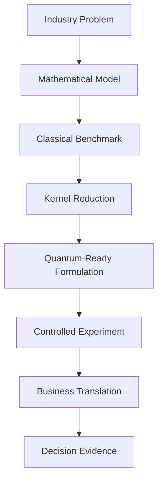

The application is therefore best understood as a productization of the **workflow discipline** represented in the source material, not as a claim that it reproduces any specific production system from enterprise or any other organization.

---

# 4. Core Product Experience

The core experience is organized into eight major screens:

1. Overview / Command Center
2. Use Cases
3. Optimization Workbench
4. Quantum Readiness Lab
5. Scenario Laboratory
6. Business Impact
7. Experiments / Runs
8. Settings / Profile

The navigation model is intentionally simple on mobile.

```text
HOME    CASES    RUN    QUANTUM    RUNS
  |       |       |        |        |
  +-------+-------+--------+--------+
                  |
               DETAILS
                  |
        +---------+---------+
        |                   |
     IMPACT              EVIDENCE
```

## 4.1 Overview

The Overview screen communicates the state of the portfolio of opportunities:

- active opportunities
- modeled annual value
- optimization runs
- quantum-ready candidates
- experiment count
- priority business cases
- optimization pipeline
- recent activity

The first screen should always make the business problem visible before exposing advanced quantum terminology.

## 4.2 Use Cases

The catalog contains deterministic synthetic cases across logistics, workforce, finance, manufacturing, energy, marketing, and healthcare.

Each card exposes:

- problem name
- business description
- modeled value
- decision-variable count
- constraint count
- confidence label
- domain tags
- case status

## 4.3 Workbench

The Workbench is the main analytical surface. It contains:

- problem definition
- objective
- scenario summary
- solver selection
- deterministic seed
- bounded iteration budget
- active constraints
- solver comparison
- constraint inspection
- run controls

The UI makes the baseline a first-class object instead of hiding it in a technical sub-screen.

## 4.4 Quantum Lab

The Quantum Lab exposes:

- QUBO size
- interaction density
- reduction ratio
- Ising conversion
- embedding estimate
- QAOA eligibility signal
- experiment controls
- explicit submission boundary

A local quantum-style sampler is labeled as a simulation/mock. A real QPU result is only displayed when an actual backend produces it.

---

# 5. Design System & UX Architecture

The redesigned frontend is inspired by enterprise cloud software patterns rather than consumer social media applications.

## 5.1 Color architecture

| Token | Purpose |
|---|---|
| `canvas` | Application background |
| `surface` | Primary card/background surface |
| `surfaceRaised` | Elevated cards and important detail panels |
| `line` | Strong borders and dividers |
| `lineSoft` | Subtle separators |
| `text` | Primary content |
| `text2` | Secondary content |
| `text3` | Metadata / tertiary text |
| `blue` | Primary product action / active state |
| `cyan` | Performance / optimization state |
| `green` | Positive / validated state |
| `amber` | Review / warning state |
| `red` | Error / critical state |
| `violet` | Quantum-specific layer |

The visual hierarchy is semantic. Blue does not mean “quantum.” Violet does.

## 5.2 Typography

The application uses a compact enterprise scale:

```text
Display        30 px / 36 px
Title          23 px / 28 px
H2             18 px / 24 px
H3             15 px / 20 px
Body           13 px / 19 px
Label          10 px / 14 px
Monospace      10 px / 15 px
```

Large numbers are intentionally separated from their labels to improve scanning.

## 5.3 Reusable components

The redesign introduces reusable components including:

```text
BrandMark
TopBar
MobileNav
EnterpriseHeader
CaseCard
RunRow
ActivityFeed
SolverTable
ConstraintInspector
BusinessImpactCard
PortfolioMini
ConvergenceCard
ScenarioCard
Section
Surface
Button
Pill
Progress
Sparkline
TinyBarChart
DataRow
ErrorState
EmptyState
```

This lets the visual language propagate consistently across all screens without copying UI primitives from a rasterized Figma image.

## 5.4 Responsive behavior

The shell switches at approximately `760px` between desktop-style navigation and mobile bottom navigation. The app is optimized for iPhone-sized layouts, but data density is preserved on larger displays.

Responsive design is treated as a **change in information priority**, not simply a reduction in font size.

---

# 6. System Architecture

The system is layered so the mobile frontend can evolve independently of the optimization engines and cloud integration boundary.

```mermaid
flowchart TB
    UI[React Native / Expo UI]
    STATE[App Context + Local Experiment State]
    SERVICES[Mobile Services]
    CORE[TypeScript Optimization Core]
    API[FastAPI Service Boundary]
    QUANTUM[Quantum Cloud Adapter]
    QB[Quantum cloud backend / Simulators / QPUs]

    UI --> STATE
    UI --> SERVICES
    STATE --> SERVICES
    SERVICES --> CORE
    SERVICES --> API
    API --> CORE
    API --> QUANTUM
    QUANTUM --> cloud provider
```

## Layer responsibilities

### UI layer

Responsible for presentation, interaction, loading states, error states, responsive layouts, and accessibility semantics.

### State layer

`src/context/AppContext.tsx` owns selected-problem and latest-result state used by the demo shell.

### Service layer

The service layer mediates between screens and computation/API functions. It is also responsible for network policies, offline fallback, report generation, experiment drafts, and device policy.

### Core layer

The `src/core` directory contains domain modeling, optimization, QUBO, readiness, embedding, scenario, sensitivity, benchmark, reliability, and business-impact logic.

### Server layer

The FastAPI server exposes bounded JSON endpoints and keeps cloud credentials outside the mobile bundle.

### Quantum layer

`server/quantum_backend_adapter.py` is intentionally a backend boundary rather than a UI concern.

---

# 7. Repository Structure

The repository is organized around the separation above.

```text
.
├── App.tsx
├── app.config.ts
├── eas.json
├── package.json
├── tsconfig.json
├── PrivacyInfo.xcprivacy
├── assets/
│   └── icon.png
├── design-reference/
│   └── quantum-roi-mobile-redesign-reference.png
├── src/
│   ├── context/
│   ├── components/
│   ├── screens/
│   ├── redesign/
│   │   ├── components/
│   │   ├── data/
│   │   ├── screens/
│   │   └── theme.ts
│   ├── core/
│   ├── services/
│   ├── data/
│   ├── domain.ts
│   ├── config.ts
│   ├── theme.ts
│   └── utils.ts
├── server/
│   ├── main.py
│   ├── models.py
│   ├── optimizers.py
│   ├── qubo.py
│   ├── quantum backend_adapter.py
│   ├── request_validation.py
│   ├── security.py
│   ├── limits.py
│   └── observability.py
├── tests/
│   ├── core.test.ts
│   ├── redesign.test.mjs
│   └── release.test.mjs
├── scripts/
│   ├── validate-release.mjs
│   ├── validate-store.mjs
│   ├── validate-source.mjs
│   ├── release-check.mjs
│   ├── check-bundle-secrets.mjs
│   └── check-format-lite.mjs
└── docs/
    ├── ARCHITECTURE.md
    ├── DATA_MODEL.md
    ├── PRODUCT_SPEC.md
    ├── RESEARCH_NOTES.md
    ├── FIGMA_MOCKUP_INTEGRATION.md
    ├── BRACKET_INTEGRATION.md
    ├── SECURITY.md
    └── ENGINEERING_BACKLOG.md
```

The repository contains both the original product screens and the redesign layer. `App.tsx` currently routes through the redesigned screens while preserving access to the underlying core and service implementations.

---

# 8. Technology Stack

## Mobile

- Expo SDK 57
- React 19.2.3
- React Native 0.86.3
- TypeScript 6.x
- Expo Status Bar

## Backend

- Python 3.13-compatible code
- FastAPI
- Pydantic
- Uvicorn
- cloud provider SDK boundary through the quantum-cloud adapter

## Optimization

- Random-key optimization
- Simulated annealing
- Greedy baselines
- QUBO construction
- QUBO evaluation
- QUBO-to-Ising conversion
- kernel reduction
- heuristic embedding estimation
- sensitivity analysis
- Monte Carlo utilities
- Pareto utilities
- benchmark summaries

## Build/release

- EAS Build
- EAS Submit
- Expo prebuild
- privacy manifest
- bundle-secret checks
- release/config validation

## Why the stack is intentionally simple

The app does not depend on a giant UI framework. The goal is to keep the mobile interface transparent enough that the business and optimization layers remain visible to engineers and researchers.

---

# 9. Domain Model

The central type definitions live in `src/domain.ts`.

## OptimizationProblem

```ts
export interface OptimizationProblem {
  id: string;
  name: string;
  domain: OptimizationDomain;
  description: string;
  objective: string;
  direction: ObjectiveDirection;
  scale: number;
  variables: number;
  constraints: Constraint[];
  assumptions: BusinessAssumption[];
  tags: string[];
}
```

A problem describes the business decision rather than the solver.

## OptimizationInput

```ts
export interface OptimizationInput {
  problem: OptimizationProblem;
  solver: SolverKind;
  seed: number;
  iterations: number;
  scenarioData:
    | DeliveryScenario
    | WorkforceScenario
    | PortfolioScenario
    | RobotScenario;
}
```

The seed and iteration budget are first-class because reproducibility matters when comparing algorithms.

## OptimizationResult

```ts
export interface OptimizationResult {
  runId: string;
  problemId: string;
  solver: SolverKind;
  status: 'complete' | 'fallback' | 'queued' | 'error';
  objective: number;
  baselineObjective: number;
  objectiveDirection: ObjectiveDirection;
  metrics: Metric[];
  decisions: Decision[];
  trace: SolverTrace[];
  violations: string[];
  quantumReadiness: QuantumReadiness;
  qaoaEligible: boolean;
  durationMs: number;
  notes: string[];
}
```

This object is the primary cross-layer contract between computation, reporting, UI, and experiment history.

## ExperimentRun

An experiment run wraps an optimization result with a scenario name, domain, solver, timestamp, and run ID. In the current demo it is stored in memory or the bounded local run store. A production platform should persist immutable experiment manifests.

---

# 10. Business Problem Catalog

The redesigned catalog currently contains 18 synthetic enterprise cases.

| ID | Case | Domain | Variables | Constraints | Status |
|---|---|---|---:|---:|---|
| CASE-001 | Middle-mile delivery network | Logistics | 142 | 37 | Active |
| CASE-002 | Workforce rostering | Workforce | 320 | 84 | Review |
| CASE-003 | Diversified portfolio selection | Finance | 48 | 22 | Ready |
| CASE-004 | Robot seam-path planning | Manufacturing | 184 | 61 | Active |
| CASE-005 | Energy unit commitment | Energy | 512 | 126 | Draft |
| CASE-006 | Ad inventory allocation | Marketing | 96 | 31 | Ready |
| CASE-007 | Clinical trial enrollment | Healthcare | 180 | 73 | Review |
| CASE-008 | Regional vehicle routing | Logistics | 88 | 24 | Active |
| CASE-009 | Factory line sequencing | Manufacturing | 224 | 67 | Ready |
| CASE-010 | Airport gate assignment | Logistics | 136 | 48 | Draft |
| CASE-011 | Reinsurance capital allocation | Finance | 76 | 29 | Review |
| CASE-012 | Warehouse slotting | Logistics | 156 | 42 | Active |
| CASE-013 | Sports venue scheduling | Marketing | 108 | 39 | Draft |
| CASE-014 | Data-center workload placement | Energy | 264 | 59 | Ready |
| CASE-015 | Procurement supplier allocation | Finance | 116 | 41 | Ready |
| CASE-016 | Maintenance window scheduling | Manufacturing | 95 | 36 | Review |
| CASE-017 | Distribution station capacity | Logistics | 124 | 34 | Active |
| CASE-018 | Customer support staffing | Workforce | 212 | 71 | Ready |

These records exist to make the product feel like an enterprise platform rather than a single hard-coded example.

## Domain philosophy

Adding a new problem should primarily require new domain logic, not a new navigation architecture.

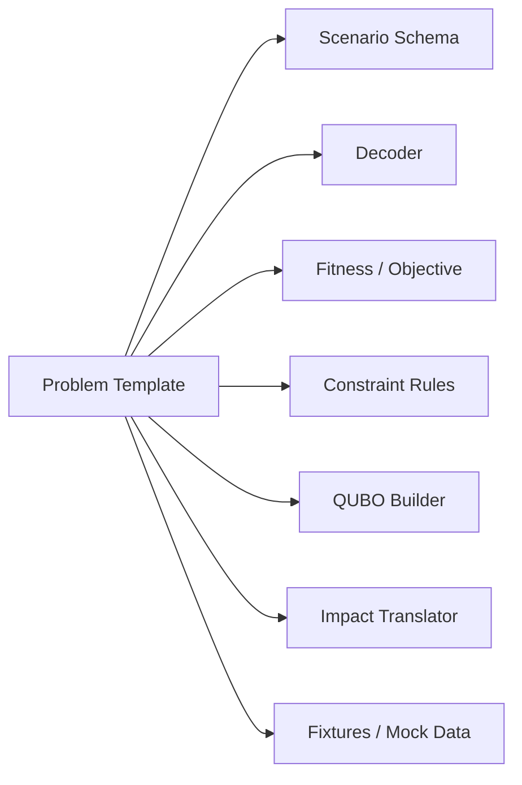

---

# 11. Optimization Engine

The core optimization engine treats a business problem as a constrained search over possible decisions.

At a simplified level:

```text
minimize or maximize
    f(x)

subject to
    hard constraints h_i(x) = 0 / <= / >=
    soft constraints s_j(x) with penalties
```

The current core contains reusable modules for several optimization domains. The design intentionally avoids treating every domain as a separate application.

## Solver contract

A solver receives normalized input and produces an `OptimizationResult`.

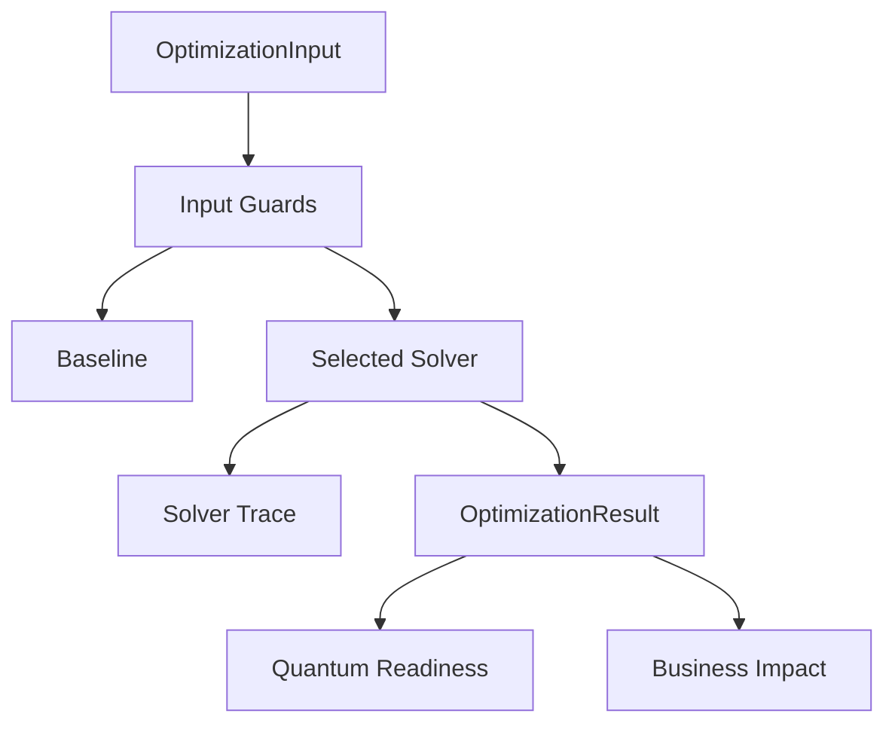

## Reliability principle

A solver result must not be treated as automatically trustworthy simply because it completed. The codebase includes result guards, constraint checks, solver safety checks, scenario validators, and explicit error/fallback states.

The UI should distinguish:

- complete
- fallback
- queued
- error
- simulated
- prepared
- live

This is especially important for quantum experiments where a prepared formulation is not the same thing as a completed hardware run.

---

# 12. Random-Key Optimization

Random-key optimization (RKO) is used as a reusable search abstraction.

The key design insight is that the optimizer itself does not need to understand the semantics of “delivery route,” “employee shift,” “asset selection,” or “robot task.” Instead it searches over `[0,1)` keys and delegates semantics to a decoder and fitness function.


The core interface is:

```ts
export interface RKOConfig {
  dimensions: number;
  populationSize: number;
  iterations: number;
  seed: number;
  decoder: (keys: number[]) => number[];
  fitness: (decision: number[]) => number;
  maximize?: boolean;
}
```

This is valuable because the same search engine can support multiple domains.

## Example decoder idea

Suppose five customer clusters must be assigned to two vehicle groups. A decoder can sort or bucket the random keys to derive an assignment. The fitness function then computes route length, capacity violations, service penalties, and business value.

The optimizer itself does not know that any of those concepts exist.

## Reproducibility

The core uses a seeded random generator so the same problem, seed, and iteration budget can be rerun for comparison.

That is why the UI exposes a seed control rather than silently generating random numbers every time.

## Important limitation

The current RKO is a research/demo implementation inspired by the random-key pattern. It should not be interpreted as a production-grade industrial optimizer without domain-specific validation, statistically repeated benchmarks, and constraint proofs.

---

# 13. Classical Baselines & Benchmarking

A central design rule is that every result should have a benchmark.

The benchmark screen presents a table such as:

| Solver | Status | Runtime | Objective | Feasible |
|---|---|---:|---:|---|
| Baseline | Reference | — | `$126.8M` | Yes |
| CP-SAT | Complete | `2m 41s` | `$111.2M` | Yes |
| RKO | Complete | `48s` | `$109.7M` | Yes |
| Annealing | Complete | `1m 12s` | `$112.6M` | Yes |
| Quantum-ready | Formulated | — | Pending | — |

These are synthetic benchmark values used by the demo.

## Benchmark summary contract

`src/core/benchmark.ts` produces a summary including:

```ts
export interface BenchmarkSummary {
  runs: number;
  bestObjective: number;
  medianObjective: number;
  medianDurationMs: number;
  feasibleRuns: number;
  objectiveSpread: number;
}
```

The application can therefore compare multiple runs rather than relying on a single lucky random seed.

## Production benchmark recommendation

A real deployment should evaluate:

- multiple random seeds
- median runtime
- p90/p95 runtime
- feasibility rate
- objective confidence interval
- solution stability
- sensitivity to input perturbations
- cloud execution cost
- operator acceptance

A single run is not evidence of solver superiority.

---

# 14. QUBO Formulation

Quantum ROI Business exposes the QUBO layer explicitly.

For binary variables:

```text
x_i ∈ {0,1}

H(x) = xᵀ Q x
```

The core model stores:

```ts
export interface QuboModel {
  n: number;
  offset: number;
  linear: number[];
  quadratic: Record<string, number>;
  variableLabels: string[];
  constraints: string[];
}
```

## Linear terms

A variable `x_i` receives a coefficient representing its contribution to the objective.

## Quadratic terms

A pair `x_i x_j` represents interactions between decisions. This is how the system captures relationships such as:

- two mutually incompatible assignments
- pairwise route interactions
- asset interactions
- sequencing conflicts
- capacity coupling

## Constraint penalties

The current QUBO helpers support patterns including:

- exactly-one
- at-most-one
- cardinality-style penalties

For an exactly-one constraint:

```text
P (Σx_i - 1)^2
```

Using binary identities, this can be expanded into linear and quadratic terms.

## Inspectability

The Quantum Lab visualizes the interaction matrix so a technical reviewer can understand whether the model is sparse or dense.

```text
     x1 x2 x3 x4 x5
x1    ●  ─  ·  ·  ●
x2    ─  ●  ·  ●  ·
x3    ·  ·  ●  ─  ·
x4    ·  ●  ─  ●  ●
x5    ●  ·  ·  ●  ●
```

## Why this matters

The QUBO is not shown as a decorative artifact. It is a handoff object between business modeling and quantum experimentation.

---

# 15. QUBO to Ising Conversion

The application provides a conventional binary-to-spin mapping:

```text
x = (1 - z) / 2

z ∈ {-1,+1}
```

This transforms the QUBO into an Ising Hamiltonian of the form:

```text
H(z) = Σ J_ij z_i z_j + Σ h_i z_i + offset
```

The conversion function in `src/core/qubo.ts` returns:

```ts
{
  J: Record<string, number>;
  h: number[];
  offset: number;
}
```

## Technical interpretation

Linear QUBO coefficients contribute both to local fields and the constant offset. Quadratic QUBO terms contribute to coupling coefficients, adjust local fields, and contribute to the offset.

## UI behavior

The Quantum Lab should let the user switch between:

- QUBO view
- Ising view
- variable labels
- constraints
- interaction density

Advanced math remains behind progressive disclosure on mobile so executives are not forced to parse equations before understanding the business result.

---

# 16. Kernel Reduction & Quantum Readiness

Large optimization models can be difficult to map directly to near-term quantum hardware. The application therefore includes a kernel-reduction concept.


The current heuristic reduction ranks variables using a combination of linear objective weight and graph interaction strength.

It explicitly reports that this is an **experimental heuristic**, not an exact reduction certificate.

## Quantum readiness score

`src/core/readiness.ts` produces a 0–100 triage score and one of:

- `strong candidate`
- `promising`
- `exploratory`
- `classical-first`

The score incorporates:

- logical variable count
- interaction density
- estimated embedding overhead
- active constraint structure
- domain-specific characteristics

The result is a **triage signal for experiment planning**, not a claim of quantum advantage.

## Embedding estimate

`src/core/embedding.ts` reports:

- logical qubits
- interaction edges
- graph density
- heuristic chain length
- estimated physical qubits
- feasibility classification

Example:

```text
Logical variables          184
Interaction density         18.7%
Heuristic chain length      3
Estimated physical qubits   552
Exploration feasibility     low
```

The numbers above are illustrative.

## Why expose the overhead

A reviewer should understand that a 64-variable logical model is not automatically a 64-physical-qubit problem. Connectivity, embedding, compilation, control overhead, and device topology affect the experiment.

---

# 17. Hybrid Quantum Workflow

The hybrid path follows this structure:

```text
Business model
    ↓
Classical benchmark
    ↓
Exact / heuristic reduction
    ↓
Reduced QUBO
    ↓
Local quantum-style sampler
    ↓
Quantum readiness
    ↓
Optional quantum backend experiment
    ↓
Postprocessing
    ↓
Business translation
```

`src/core/hybridPipeline.ts` currently performs a local proof-of-concept path:

1. build the domain QUBO
2. reduce the kernel
3. locally sample the reduced QUBO
4. compute quantum-readiness metadata
5. produce an `OptimizationResult`

The result explicitly says:

```text
Quantum-style local measurement mock; no QPU was used.
```

That wording is important.

## Why the hybrid pattern matters

Many enterprise optimization problems are too large to send directly to hardware. A hybrid architecture lets the classical layer perform decomposition, preprocessing, reduction, scheduling, postprocessing, or parameter optimization around the quantum component.

The product therefore treats quantum execution as a **controlled experiment** inside a broader optimization system.

## Recommended future extension

Implement solver-specific compilation modules for:

- QAOA circuits
- annealing-compatible Ising forms
- device-specific embedding
- parameter sweeps
- multi-seed benchmark jobs

These should plug into the existing experiment contract instead of changing the mobile screens.

---

# 18. Business Impact Translation

Optimization output should not stop at a percentage.

The business-impact layer attempts to answer:

> **What does the modeled objective movement mean in the business language of this particular domain?**

`src/core/businessImpact.ts` translates available metrics into contextual impact estimates.

## Delivery example

Possible metric chain:

```text
Baseline route cost
        ↓
Optimized route cost
        ↓
Cost delta
        ↓
Modeled cost avoided
```

## Workforce example

Possible chain:

```text
Baseline staffing cost
       ↓
Optimized staffing cost
       ↓
Overtime change
       ↓
Modeled labor-cost delta
```

## Portfolio example

The current demo translates selected asset decisions into an expected-return movement using a simple equal-weight demonstration portfolio.

It explicitly notes that production use would require a client-approved allocation model.

## Business-impact rules

Every estimate should show:

- title
- numeric value
- unit
- statement
- methodology

That creates an evidence trail instead of a mysterious number on a KPI card.

---

# 19. Scenario Analysis & Sensitivity

Real operational decisions are uncertain. A single point estimate is rarely enough.

The scenario lab includes:

- Conservative
- Base
- Expansion

Each scenario changes assumptions such as:

- optimization improvement
- adoption rate
- implementation timeline
- risk adjustment

## Scenario structure

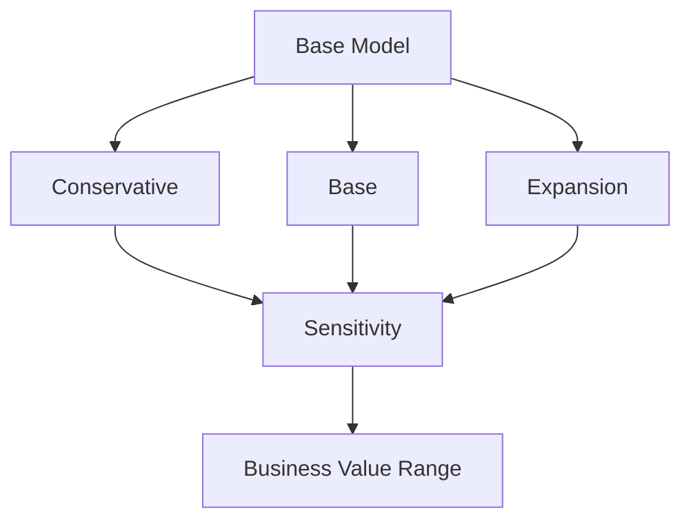

## Sensitivity factors

The analysis can vary:

- optimization improvement
- adoption rate
- implementation cost
- time to value
- operating cost
- data-readiness assumptions
- quantum execution cost

## Tornado chart interpretation

The sensitivity screen should answer:

**Which assumptions have the largest effect on modeled net value?**

The chart is not a prediction engine. It is an assumption-stress tool.

## Production recommendation

Replace static scenario fixtures with:

- historical distributions
- approved business assumptions
- Monte Carlo simulation
- robust optimization
- confidence intervals
- observed post-deployment outcomes

---

# 20. Enterprise Mobile UI

The mobile redesign is a translation of the Figma reference into native React Native components.

The app supports the following mobile content priorities:

```text
1. What is this business case?
2. What is the baseline?
3. What changed?
4. What is the modeled value?
5. What assumptions matter?
6. What is the technical formulation?
7. What evidence exists?
```

## 20.1 Mobile Home

The home screen combines:

- summary KPIs
- priority opportunities
- pipeline status
- recent activity

The bottom navigation keeps the main routes accessible by thumb.

## 20.2 Mobile Workbench

The Workbench uses progressive disclosure:

```text
Problem
  ↓
Baseline
  ↓
Optimization
  ↓
Scenarios
  ↓
Quantum readiness
  ↓
Evidence
```

Advanced technical sections can expand without overwhelming the main flow.

## 20.3 Mobile Quantum Lab

The Quantum Lab uses a violet semantic layer with explicit state labels:

- SIMULATED / DEMO
- PREPARED
- NOT SUBMITTED
- COMPLETED

A “Run simulation” action is clearly different from “Submit to quantum device.”

## 20.4 Interaction states

Every important screen has:

- loading state
- empty state
- offline state
- validation error
- retry state
- review state

This is particularly important for App Store quality and network reliability.

---

# 21. Realistic Synthetic Data

The redesigned interface ships with larger synthetic datasets so the app demonstrates the shape of an enterprise platform.

## Dataset categories

### Business cases

18 use cases across multiple industries.

### Experiments

Multiple experiment records include:

- run ID
- case
- solver
- variables
- constraints
- baseline
- objective
- runtime
- feasibility
- status
- date

### Activities

Recent events include:

- optimization completed
- scenario updated
- formulation created
- dataset imported
- experiment prepared
- constraint conflict detected
- report exported

### Portfolio

A synthetic diversified asset mix includes:

- ticker
- sector
- allocation
- expected return
- risk

### Analytics

The redesign includes deterministic values for:

- KPI cards
- charts
- trend lines
- scenario ranges
- cost drivers
- value drivers

## Synthetic-data disclosure

Every demo surface should make it clear that the values are synthetic.

Recommended UI label:

> `Synthetic demonstration data`

The app must never imply that demo values are enterprise internal metrics or measured customer results.

---

# 22. Application Navigation

The application shell is implemented in `App.tsx`.

## Desktop navigation

```text
Overview
Opportunities
Workbench
Quantum
Scenarios
Impact
Runs
Settings
```

## Mobile navigation

```text
Home
Cases
Run
Quantum
Runs
```

## Screen mapping

| Route state | Screen |
|---|---|
| `home` | `OverviewScreen` |
| `useCases` | `CasesScreen` |
| `scenario` | `WorkbenchScreen` |
| `results` | `ImpactScreen` |
| `insights` | `ScenarioLabScreen` |
| `compare` | `QuantumLabScreen` |
| `experiment` | `RunsScreen` |
| `qubo` | `QuantumLabScreen` |
| `settings` | `SettingsRedesignScreen` |

The current simplified shell uses a `ScreenName` union rather than a large navigation library. This keeps the proof-of-concept predictable and dependency-light.

## Navigation safety

When a user navigates to results without a valid `lastResult`, the shell routes to the insights/scenario experience instead of rendering an invalid result state.

That kind of guard prevents common demo-time navigation crashes.

---

# 23. API Architecture

The FastAPI service provides a controlled server boundary.

## Current endpoints

```text
GET  /health
POST /v1/model/qubo
POST /v1/optimize
POST /v1/quantum-backend/submit
```

## Request pipeline

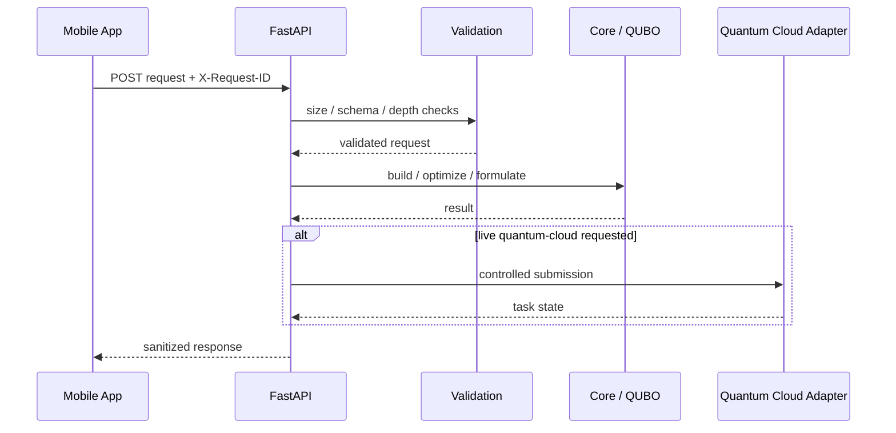

## `/health`

Returns a small service-health object including:

- service name
- API version
- live quantum-cloud enablement

## `/v1/model/qubo`

Builds a normalized QUBO representation and returns a stable run ID.

## `/v1/optimize`

Returns a server-side demo optimization result with bounded iterations and a safety-net path.

## `/v1/quantum-backend/submit`

Explicitly blocked unless the server-side live flag is enabled.

This endpoint should not be exposed publicly without authentication, authorization, quotas, cost controls, and experiment ownership checks.

---

# 24. Quantum Cloud Backend Integration Boundary

The design keeps cloud provider credentials off the mobile device.

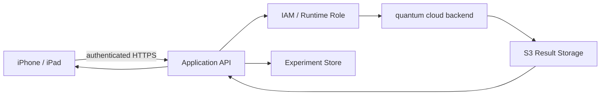

## Environment variables

The server-side boundary expects values such as:

```text
cloud provider_REGION=us-east-1
QUANTUM_DEVICE_ARN=<compatible-device-arn>
QUANTUM_RESULT_BUCKET=<customer-controlled-bucket>
QUANTUM_RESULT_PREFIX=quantum-roi/
```

## Production principles

Never ship:

- cloud provider access keys
- secret keys
- long-lived IAM tokens
- privileged cloud credentials

in an Expo application.

The mobile client should authenticate to the application backend. The backend should own the quantum-cloud submission process.

## Device compatibility

The backend should validate:

- device ARN format
- device availability
- supported program type
- connectivity requirements
- qubit count
- shots limits
- cost limits
- tenant authorization

before submission.

## Direct task vs hybrid job

A direct quantum task is appropriate when a compiled workload is already defined for a device. A hybrid job is appropriate when classical optimization and quantum execution must interact repeatedly.

The mobile UI should not need to know which pattern is being used; it should only receive an experiment state machine and result contract.

---

# 25. Security & Data Governance

Security is a product feature, not an appendix.

## Mobile security boundary

The phone may safely contain:

- synthetic demo data
- user-selected scenario options
- non-sensitive report previews
- experiment IDs

The phone should not contain:

- cloud provider credentials
- customer master data without an approved storage architecture
- privileged IAM tokens
- secrets for third-party systems

## Server security

The FastAPI middleware enforces:

- request-size limits
- rate limiting
- bounded JSON depth
- origin configuration
- sanitized error responses
- secure response headers
- request IDs

## Request-size limits

The server rejects oversized payloads before attempting expensive processing.

## Rate limiting

The demo uses an in-memory rate limiter for protection during development. Production deployment should move to a distributed gateway or API-level limiter.

## Logging rules

Operational logging should capture:

- request ID
- route
- status code
- latency
- solver state
- experiment ID

It should not log raw sensitive business records by default.

## Data minimization

A production data ingestion layer should transform raw operational records into only the features needed for optimization.

```text
Raw enterprise data
       ↓
Validation
       ↓
Aggregation / minimization
       ↓
Optimization-ready schema
       ↓
Experiment manifest
```

---

# 26. Reliability & Error Handling

The application was hardened specifically to avoid the common failure mode where an enterprise demo looks correct until a network call, invalid scenario, or malformed solver result occurs.

## Error categories

### User validation

Examples:

- incompatible constraints
- invalid iteration budget
- invalid scenario configuration

### Network errors

Examples:

- API unavailable
- timeout
- malformed response
- HTTP 5xx

### Solver errors

Examples:

- numerical instability
- unsupported domain
- impossible feasibility target

### Quantum execution errors

Examples:

- unavailable device
- invalid program
- quota rejection
- cloud task failure

## State machine

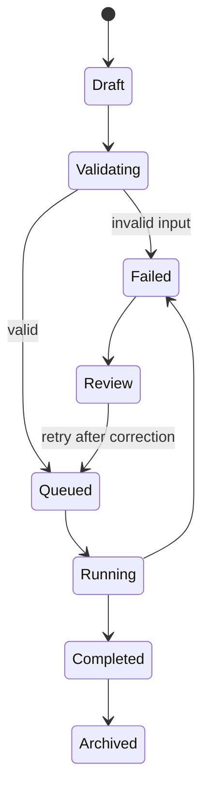

## Important reliability rule

An exhausted live quantum execution must never silently become a fake “completed” result.

The correct behavior is:

```text
Live execution failed
       ↓
Preserve failure metadata
       ↓
Show explicit failed state
       ↓
Offer retry / review
```

rather than:

```text
Live execution failed
       ↓
Show a fabricated completed result
```

That distinction is fundamental to trustworthy optimization software.

---

# 27. Offline-First Demonstration Behavior

A mobile demo must continue functioning when Wi-Fi is unreliable.

The app therefore uses local deterministic computation and bounded local experiment storage for demonstration flows.

## Offline behavior

When the cloud API is unavailable:

1. show an offline notice
2. allow supported local demo computations
3. preserve the experiment record
4. mark cloud-required features as unavailable
5. never imply that a QPU job ran

## Local run store

`src/services/offlineRunStore.ts` keeps a bounded collection of run envelopes.

The current demo caps storage at 20 entries.

## Why this matters for demos

A technical presentation should fail gracefully even when network conditions are imperfect.

The UI should tell the user:

> `Offline mode — saved demonstration scenarios remain available. Cloud experiments require a connection.`

That feels much more professional than a raw fetch exception.

---

# 28. Reporting, Evidence & Reproducibility

Optimization decisions become more credible when the run can be reconstructed.

The application therefore treats a run as an evidence object.

## Recommended experiment manifest

```json
{
  "applicationVersion": "2.x",
  "schemaVersion": "1",
  "problemId": "CASE-001",
  "solver": "rko",
  "seed": 42,
  "iterations": 30,
  "inputHash": "...",
  "constraintHash": "...",
  "objectiveWeights": {},
  "datasetSnapshotId": "synthetic-demo-v1",
  "quboHash": "...",
  "backend": "local-demo",
  "deviceArn": null,
  "status": "completed"
}
```

## Evidence hierarchy

```text
Problem definition
      ↓
Input snapshot
      ↓
Constraint set
      ↓
Baseline run
      ↓
Solver run
      ↓
QUBO / Ising formulation
      ↓
Scenario analysis
      ↓
Business-impact translation
      ↓
Decision brief
```

## Report principle

A report should be understandable to an executive while allowing a technical reviewer to drill down into the exact inputs and methods.

The redesign therefore supports report/export-oriented components rather than relying only on screenshots.

---

# 29. Testing & Validation

The repository includes multiple validation layers.

## TypeScript tests

`tests/core.test.ts` exercises core optimization/math paths.

## Redesign tests

`tests/redesign.test.mjs` verifies the presence and structure of the new frontend surface.

## Release tests

`tests/release.test.mjs` covers release invariants.

## Static validation scripts

```text
scripts/validate-release.mjs
scripts/validate-store.mjs
scripts/validate-source.mjs
scripts/release-check.mjs
scripts/check-bundle-secrets.mjs
scripts/check-format-lite.mjs
```

## Recommended validation sequence

```bash
npm run typecheck
npm test
npm run test:redesign
npm run validate
npm run validate:store
npm run release:check
npm run format:check
npx expo-doctor
```

## Why static validation matters

Build environments are not always available. Package registries can fail, native credentials may be absent, or cloud build services may be unreachable.

Static checks should therefore catch:

- malformed JSON
- broken configuration
- obvious production localhost endpoints
- accidental secrets
- invalid release metadata
- structural regressions

before EAS ever runs.

---

# 30. iOS App Store Readiness

The project includes App Store hardening from the earlier release-failure pass.

## Package configuration

The current `package.json` uses a coherent Expo 57 / React Native 0.86 / React 19.2.x stack and includes scripts for:

- local development
- iOS prebuild
- EAS preview build
- EAS production build
- EAS submission
- validation
- testing

## App configuration

`app.config.ts` configures:

- app name
- slug
- version
- bundle identifier
- iOS deployment target
- tablet support
- splash background
- runtime version
- non-exempt encryption declaration
- privacy manifest
- public API URL
- privacy policy URL
- support URL

## Production URL rule

The app must never rely on `localhost` as a production API default.

Production API values should be supplied through environment variables and validated as HTTPS.

## Privacy

The release includes a privacy manifest file and placeholder environment settings for the privacy policy and support URLs.

The legal URLs must be real URLs before App Store submission.

## Build flow

```bash
npm ci
npm run validate
npm run validate:store
npm run release:check
npx expo-doctor
npx expo prebuild --clean --platform ios
eas build --platform ios --profile production
eas submit --platform ios --profile production
```

The exact Apple-side checklist should also include:

- app privacy answers
- age rating
- category
- screenshots
- description
- subtitle
- keywords
- support URL
- privacy policy URL
- export compliance
- signing configuration
- review notes

---

# 31. Local Development

## Prerequisites

Recommended:

- Node.js 22.x compatible with the repository engine declaration
- npm 10.x
- Python 3.13-compatible runtime
- Expo CLI through local project scripts
- Xcode for native iOS development
- EAS CLI for cloud builds

## Install

```bash
npm ci
```

## Start Metro / Expo

```bash
npm start
```

## Run iOS locally

```bash
npm run ios
```

## Run web

```bash
npm run web
```

## Type checking

```bash
npm run typecheck
```

## Tests

```bash
npm test
npm run test:redesign
```

## Release validation

```bash
npm run validate
npm run validate:store
npm run release:check
```

---

# 32. Server Development

The server is a FastAPI application in `server/main.py`.

## Environment

Copy:

```bash
cp server/.env.example server/.env
```

Configure only server-safe environment values.

## Run

```bash
npm run server
```

The development API binds to loopback by default.

## Health check

```bash
curl http://127.0.0.1:8787/health
```

Example response:

```json
{
  "ok": true,
  "service": "quantum-roi-business",
  "version": "2.0.1",
  "livequantum backendEnabled": false
}
```

## Development vs production

Development may enable local testing conveniences, but production should enforce:

- authenticated requests
- tenant authorization
- HTTPS
- hardened CORS
- bounded request sizes
- distributed rate limits
- audit logging
- customer-specific experiment ownership
- cloud cost controls

---

# 33. Production Deployment

The production deployment should be split into independently deployable surfaces.

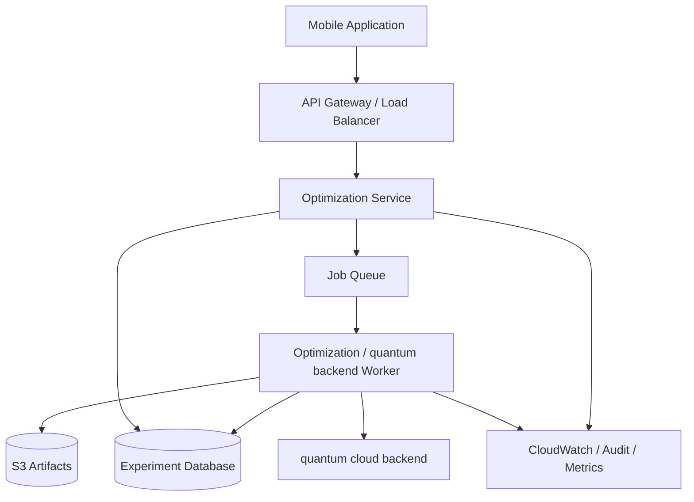

## Recommended production separation

### Mobile

Responsible for interaction and cached presentation.

### API

Responsible for authentication, authorization, validation, model creation, job creation, and result retrieval.

### Worker

Responsible for long-running optimization and quantum jobs.

### Database

Responsible for experiment manifests, users, projects, approvals, and result metadata.

### S3

Responsible for large experiment artifacts, exported reports, and quantum task outputs.

### Observability

Responsible for operational telemetry and audit trails.

---

# 34. Demo Runbook

A five-to-seven minute demo can follow the sequence below.

## Step 1 — Start at Overview

Open **Optimization Intelligence**.

Point out:

- active opportunities
- modeled value
- optimization runs
- quantum-ready candidates

Say:

> “This is a decision laboratory. The product starts with business problems rather than quantum hardware.”

## Step 2 — Open Middle-Mile Delivery

Open the logistics use case.

Show:

- baseline cost
- service coverage
- variables
- constraints

## Step 3 — Run the Workbench

Choose RKO.

Show:

- iteration budget
- deterministic seed
- active constraints

Run the experiment.

## Step 4 — Inspect the result

Show the baseline beside the optimized result.

Emphasize that the numbers are synthetic.

## Step 5 — Open Quantum Lab

Show:

- QUBO size
- reduced kernel
- interaction density
- readiness category
- embedding estimate

Then point out:

> “This is the handoff point between classical optimization and a quantum experiment.”

## Step 6 — Open Scenario Lab

Compare:

- conservative
- base
- expansion

Then show the sensitivity chart.

## Step 7 — Finish with Business Impact

Show:

- modeled annual value
- cost reduction
- investment
- net value
- scenario range

Close by emphasizing that the system is designed to keep assumptions and evidence attached to the decision.

---

# 35. Extension Guide

A new business domain should follow a predictable template.

## Step 1 — Add a domain type

Extend `OptimizationDomain`.

## Step 2 — Create scenario data

Define the domain-specific data model.

## Step 3 — Define the objective

Make the direction explicit:

```text
minimize cost
maximize yield
maximize coverage
minimize makespan
```

## Step 4 — Define constraints

Separate hard feasibility constraints from soft preferences.

## Step 5 — Add decoder/fitness

For RKO or another heuristic, define how a candidate representation becomes a business decision.

## Step 6 — Add QUBO builder

Convert binary decisions and constraints into a QUBO.

## Step 7 — Add impact translation

Translate model metrics into business language.

## Step 8 — Add mock fixtures

Create deterministic synthetic data large enough to exercise the UI.

## Step 9 — Add tests

At minimum:

- valid input
- invalid input
- feasible solution
- constraint violation
- deterministic repeatability
- stable report output

## Step 10 — Add UI mapping

Reuse existing screen components instead of introducing a new navigation hierarchy.

---

# 36. Performance Strategy

Performance is especially important for a mobile optimization demo because computational work can easily block rendering.

## Principles

### Keep the UI thread responsive

Heavy optimization should run through bounded work or a server boundary in production.

### Bound iteration counts

The Workbench currently exposes a bounded search budget.

### Bound server payloads

Large request bodies and deeply nested JSON are rejected.

### Avoid unnecessary rerenders

Use memoization where state-derived content is expensive.

### Keep charts lightweight

The current charts are custom React Native primitives rather than heavy charting dependencies.

## Target behavior

The UI should remain responsive while an experiment runs.

Recommended future architecture:

```text
UI thread
   |
   +--> interaction
   +--> progress
   +--> result presentation

Worker / server
   |
   +--> optimization
   +--> QUBO generation
   +--> simulation
   +--> quantum backend jobs
```

---

# 37. Accessibility

Accessibility is especially important because enterprise users often consume dense analytical interfaces for long periods.

## Requirements

- accessible roles for interactive elements
- labels for icon-only controls
- sufficient text contrast
- state labels that do not depend on color alone
- readable chart summaries
- large enough tap targets
- logical reading order
- screen-reader labels for major navigation items

## Example

A green badge should not only say “green.” It should say:

```text
Status: Completed
```

A chart should have both the visual representation and a textual summary.

## Dynamic type

The compact visual language should remain understandable if the user increases system text size. Critical values should not depend on one fixed line-height.

## VoiceOver

Recommended accessibility labels include:

```text
“Run RKO optimization, 30 iterations.”
“Quantum readiness score 68, promising.”
“Baseline cost 126.8 million dollars.”
```

---

# 38. Observability

The server emits structured request events with:

- request ID
- method
- path
- status
- latency

The observability module should be extended in production to include:

- experiment ID
- solver
- domain
- model size
- job state transitions
- cloud task ID
- device ARN
- estimated cost
- actual cost
- error category

## Useful dashboards

### API health

```text
Requests/min
Error rate
p50 latency
p95 latency
Rate-limit events
```

### Optimization health

```text
Runs completed
Runs failed
Feasible rate
Average objective improvement
Average runtime
```

### Quantum health

```text
Submitted tasks
Queued tasks
Completed tasks
Failed tasks
Average queue time
Average task cost
```

### Product health

```text
Active cases
Scenario runs
Report exports
Offline sessions
Crash-free sessions
```

---

# 39. Common Failure Modes

## Failure: production API is localhost

### Symptom

The app works on the developer Mac but not on a physical device.

### Prevention

`app.config.ts` requires a properly supplied production API URL and validates the origin.

---

## Failure: live quantum-cloud failure becomes a fake success

### Symptom

A cloud task fails but the UI shows a completed result.

### Prevention

Keep live task states explicit and persist failure metadata.

---

## Failure: malformed QUBO crashes the screen

### Prevention

Use QUBO validation and result guards before rendering technical values.

---

## Failure: huge scenario payload causes server instability

### Prevention

Enforce content-length limits and parsed-object bounds.

---

## Failure: navigation reaches a result screen without a result

### Prevention

`App.tsx` redirects invalid result navigation to a safe state.

---

## Failure: secrets are bundled into the app

### Prevention

Keep cloud secrets server-side and run bundle-secret checks before release.

---

## Failure: App Store build works locally but fails in EAS

### Prevention

Run:

```bash
npm run validate
npm run validate:store
npm run release:check
npx expo-doctor
```

before invoking the cloud build.

---

# 40. Research Limitations & Scientific Honesty

This section is deliberately explicit.

## The readiness score is not quantum advantage

A readiness score is a heuristic triage metric based on model characteristics. It does not establish that a quantum device will beat a classical solver.

## The embedding estimate is not a hardware embedding

The application provides a planning heuristic. A real device requires a device-specific embedding or compilation process.

## The local quantum sampler is not a QPU

The current quantum-style proof-of-concept uses local computation. The UI labels this clearly.

## Synthetic data is not production evidence

Synthetic cases demonstrate the product architecture and interaction patterns.

## Business value is modeled

The application derives business-impact estimates from supplied scenario assumptions. It does not automatically establish realized savings.

## Benchmarking is incomplete

A production-grade scientific study would require:

- repeated runs
- multiple seeds
- statistical analysis
- identical hardware/cloud conditions
- solver configuration controls
- data-quality validation
- reproducibility artifacts
- cost measurement
- independent verification

## Why this honesty improves the product

A technically sophisticated reviewer is more likely to trust a tool that clearly distinguishes:

```text
Observed
Modeled
Simulated
Prepared
Estimated
Live
```

from one that collapses all six into a single green “success” state.

---

# 41. Roadmap

## Phase 1 — Product credibility

- persistent experiment manifests
- multi-seed benchmarking
- stronger constraint verification
- exact baseline selection
- immutable model versions

## Phase 2 — quantum-cloud execution

- solver-specific compilation
- device property discovery
- explicit approval workflow
- cloud job state machine
- S3 artifact persistence
- cost estimate before submission

## Phase 3 — Enterprise integration

- CSV/JSON import
- approved API connectors
- workspace support
- role-based access
- experiment ownership

## Phase 4 — Advanced optimization

- exact classical methods for small models
- constraint programming
- integer programming
- robust optimization
- uncertainty-aware optimization
- Pareto-frontier analysis

## Phase 5 — Realized KPI feedback

Connect actual production outcomes back to the original model.

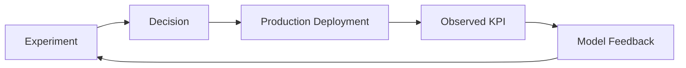

This closes the loop from “interesting optimization result” to “measured operational impact.”

---

# 42. Contribution Guide

## Branching

Use feature branches for changes to:

- mobile UI
- optimization core
- server
- cloud integration
- documentation

## Pull request checklist

```text
[ ] Existing business logic preserved
[ ] Tests added / updated
[ ] Error states covered
[ ] Synthetic-data disclosure retained
[ ] No credentials introduced
[ ] API contracts unchanged or versioned
[ ] Mobile accessibility reviewed
[ ] App Store validation passes
```

## Coding style

Prefer explicit types over `any` in domain code.

Keep business rules in `src/core` rather than inside React components.

Keep cloud credentials out of `src/`.

Keep UI components reusable.

Keep server validation close to the API boundary.

## Commit examples

```text
feat: add warehouse slotting scenario
fix: prevent invalid qubo rendering
perf: memoize scenario summary
security: reject untrusted production origins
test: add deterministic rko regression case
docs: update quantum backend experiment contract
```

---

# 43. Source-to-Product Mapping

The following mapping describes how themes from the supplied presentation become product features.

| Source theme | Product implementation |
|---|---|
| Problem-focused research | Business-first Overview and Use Case flow |
| Robot path optimization | Robotics domain model and scenario |
| Portfolio optimization | Portfolio domain and QUBO workflow |
| Workforce rostering | Workforce scenario and constraint model |
| Next-day delivery | Delivery scenario and route metrics |
| Random-key optimization | `src/core/rko.ts` |
| QUBO | `src/core/qubo.ts`, `server/qubo.py` |
| Ising | QUBO conversion utilities |
| Hardware embedding | `src/core/embedding.ts` |
| Hybrid pipeline | `src/core/hybridPipeline.ts` |
| Quantum readiness | `src/core/readiness.ts` |
| Scenario analysis | sensitivity/scenario modules |
| quantum cloud backend | `server/quantum_backend_adapter.py` |
| Business value | `src/core/businessImpact.ts` |
| Evidence/review | experiment/report components |

The source material discusses the need to work backwards from the practical problem and shows multiple industry optimization applications. The README preserves that framing rather than turning the project into a quantum-only product narrative.

---

# 44. Technical Diagram Appendix

## 44.1 End-to-end architecture

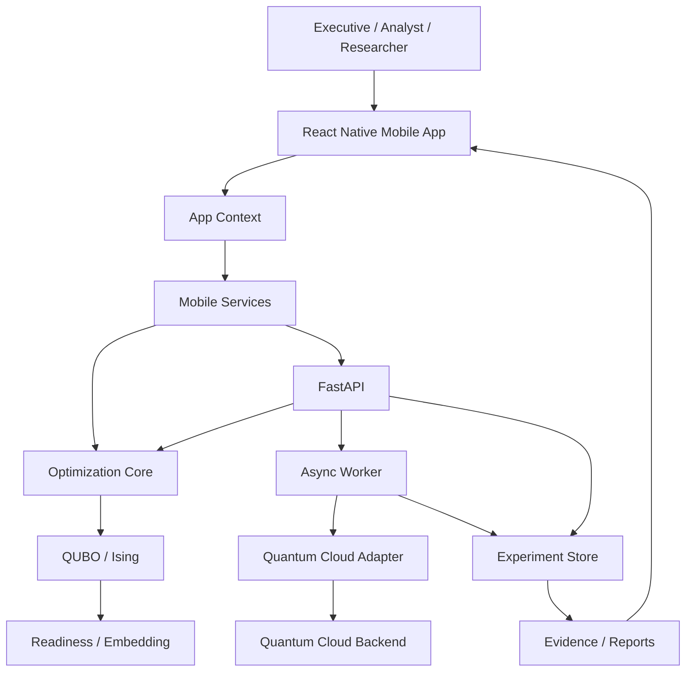

## 44.2 Optimization lifecycle

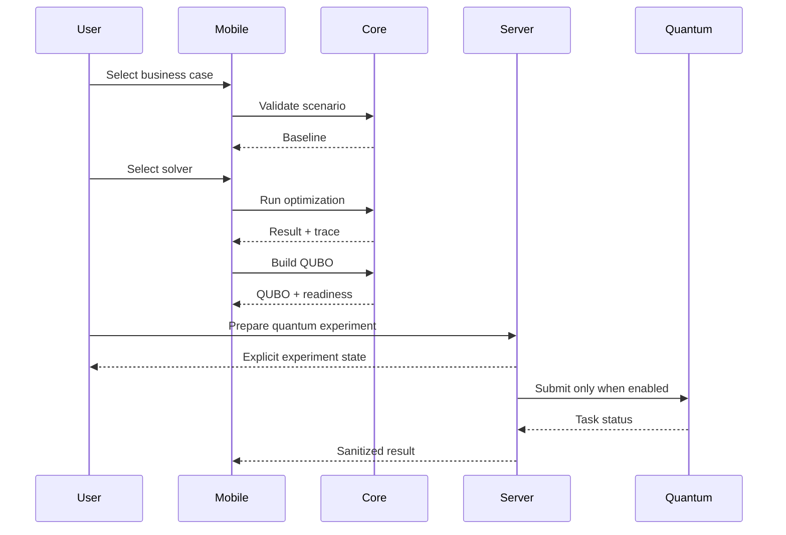

## 44.3 Mobile state machine

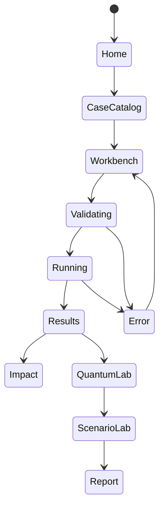

## 44.4 QUBO data flow

```text
Business rules
    |
    +--> objective coefficients
    |
    +--> conflict penalties
    |
    +--> exactly-one constraints
    |
    +--> capacity / cardinality penalties
    |
    v
QUBO Model
    |
    +--> evaluateQubo()
    +--> serializeQubo()
    +--> quboToIsing()
    +--> reduceQuboKernel()
    |
    v
Quantum Readiness
```

## 44.5 Evidence flow

```text
Run ID
  |
  +--> Problem snapshot
  +--> Solver configuration
  +--> Seed
  +--> Baseline
  +--> Optimized objective
  +--> Constraint status
  +--> QUBO hash
  +--> Readiness score
  +--> Scenario analysis
  +--> Business impact
  +--> Report
```

---

# 45. Example Data Contracts

## Example delivery problem

```json
{
  "problem": {
    "id": "CASE-001",
    "name": "Middle-mile delivery network",
    "domain": "delivery",
    "description": "Reduce network operating cost while expanding next-day delivery coverage.",
    "objective": "Minimize network operating cost",
    "direction": "minimize",
    "scale": 8,
    "variables": 142,
    "constraints": [],
    "assumptions": [],
    "tags": ["routing", "middle-mile", "capacity", "RKO"]
  },
  "solver": "rko",
  "seed": 42,
  "iterations": 30,
  "scenarioData": {}
}
```

## Example result

```json
{
  "runId": "QX-1048",
  "problemId": "CASE-001",
  "solver": "rko",
  "status": "complete",
  "objective": 109.7,
  "baselineObjective": 126.8,
  "objectiveDirection": "minimize",
  "violations": [],
  "qaoaEligible": false,
  "durationMs": 48000,
  "notes": [
    "Synthetic demonstration result."
  ]
}
```

## Example readiness

```json
{
  "score": 68,
  "category": "promising",
  "qubitsEstimate": 64,
  "embeddingOverhead": 1.9,
  "reasons": [
    "Reduced kernel has manageable logical size.",
    "Interaction graph remains structured."
  ],
  "recommendedNextStep": "Compare the reduced formulation with classical baselines and a quantum simulator."
}
```

These values are illustrative and should not be interpreted as measured hardware performance.

---

# 46. Example API Contracts

## GET `/health`

```json
{
  "ok": true,
  "service": "quantum-roi-business",
  "version": "2.0.1",
  "livequantum backendEnabled": false
}
```

## POST `/v1/model/qubo`

Response shape:

```json
{
  "qubo": {
    "n": 64,
    "offset": 0,
    "linear": [],
    "quadratic": {},
    "variableLabels": [],
    "constraints": []
  },
  "runId": "stable-hash"
}
```

## POST `/v1/quantum-backend/submit`

When live execution is not enabled:

```json
{
  "status": "blocked",
  "taskId": "blocked-QX-1048",
  "message": "Live quantum-cloud execution is disabled. Enable it explicitly on the server after configuring IAM, S3, device allowlists, quotas, and cost controls."
}
```

This explicit behavior is preferable to a fake success or an ambiguous 500 response.

---

# 47. Decision Review Checklist

Before declaring an optimization opportunity ready for deeper enterprise evaluation, review the following.

## Business

```text
[ ] Problem owner identified
[ ] Objective is measurable
[ ] Baseline is defined
[ ] Business value methodology documented
[ ] Adoption assumptions documented
```

## Optimization

```text
[ ] Decision variables defined
[ ] Hard constraints separated from soft preferences
[ ] Feasibility validated
[ ] Classical baseline available
[ ] Multi-run benchmark planned
```

## Quantum

```text
[ ] QUBO / Ising formulation exists
[ ] Variable count known
[ ] Interaction density known
[ ] Kernel reduction explained
[ ] Embedding overhead estimated
[ ] Device compatibility checked
[ ] Cloud cost controls defined
```

## Security

```text
[ ] No credentials in mobile bundle
[ ] API origin is HTTPS
[ ] Rate limiting enabled
[ ] Request size bounded
[ ] Error responses sanitized
[ ] Audit trail defined
```

## Product

```text
[ ] Mobile flow is understandable
[ ] Loading states exist
[ ] Error states exist
[ ] Offline behavior is explicit
[ ] Synthetic data is labeled
[ ] Accessibility reviewed
```

## Evidence

```text
[ ] Input snapshot stored
[ ] Seed recorded
[ ] Solver version recorded
[ ] QUBO hash recorded
[ ] Scenario assumptions recorded
[ ] Report generated
```

---

# 48. Final Product Thesis

Quantum ROI Business is designed to make the following statement concrete:

> **Quantum optimization is most valuable when it is connected to a real decision, a measurable objective, a credible classical benchmark, a transparent mathematical formulation, and a business value model.**

The product intentionally connects these layers.

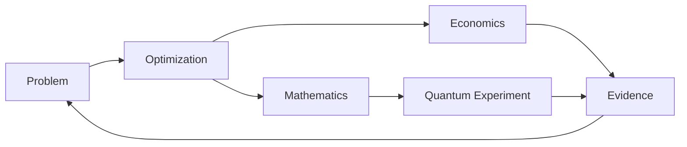

The application is strongest when it behaves less like a science-fiction showcase and more like a rigorous enterprise laboratory.

A useful review session should allow a technical audience to say:

```text
I understand the business problem.
        ↓
I understand the baseline.
        ↓
I understand the constraints.
        ↓
I can see the classical benchmark.
        ↓
I can inspect the QUBO.
        ↓
I understand the reduction.
        ↓
I can see why a quantum experiment might be interesting.
        ↓
I can also see why the classical path may remain the production path.
        ↓
I can inspect the assumptions behind the business value.
        ↓
I can reproduce or challenge the experiment.
```

That is the intended “wow” factor of the product: not a flashy quantum animation, but a coherent path from **enterprise problem → optimization model → evidence → potential quantum experiment → decision**.

---

## Appendix A — Key Source Files

### Mobile shell

- `App.tsx`
- `src/context/AppContext.tsx`

### Domain contracts

- `src/domain.ts`
- `src/types.ts`

### Redesign

- `src/redesign/theme.ts`
- `src/redesign/components/enterprise.tsx`
- `src/redesign/components/advanced.tsx`
- `src/redesign/components/ui.tsx`
- `src/redesign/screens/OverviewScreen.tsx`
- `src/redesign/screens/CasesScreen.tsx`
- `src/redesign/screens/WorkbenchScreen.tsx`
- `src/redesign/screens/QuantumLabScreen.tsx`
- `src/redesign/screens/ScenarioLabScreen.tsx`
- `src/redesign/screens/ImpactScreen.tsx`
- `src/redesign/screens/RunsScreen.tsx`
- `src/redesign/screens/SettingsRedesignScreen.tsx`

### Optimization core

- `src/core/rko.ts`
- `src/core/qubo.ts`
- `src/core/hybridPipeline.ts`
- `src/core/readiness.ts`
- `src/core/embedding.ts`
- `src/core/benchmark.ts`
- `src/core/businessImpact.ts`
- `src/core/scenarioEngine.ts`
- `src/core/sensitivity.ts`
- `src/core/constraintEngine.ts`
- `src/core/reliability.ts`
- `src/core/solverSafety.ts`

### Services

- `src/services/api.ts`
- `src/services/http.ts`
- `src/services/optimizationService.ts`
- `src/services/experimentRunner.ts`
- `src/services/offlineRunStore.ts`
- `src/services/quboService.ts`
- `src/services/quantumBackend.ts`
- `src/services/reportGenerator.ts`

### Backend

- `server/main.py`
- `server/models.py`
- `server/qubo.py`
- `server/optimizers.py`
- `server/quantum_backend_adapter.py`
- `server/security.py`
- `server/request_validation.py`
- `server/limits.py`
- `server/observability.py`

---

## Appendix B — Documentation Map

| Document | Purpose |
|---|---|
| `docs/ARCHITECTURE.md` | Layering, design decisions, backend boundary |
| `docs/DATA_MODEL.md` | Domain and experiment contracts |
| `docs/PRODUCT_SPEC.md` | UX/product principles and flow |
| `docs/RESEARCH_NOTES.md` | Source-grounded product rationale |
| `docs/FIGMA_MOCKUP_INTEGRATION.md` | Figma-to-React Native mapping |
| `docs/BRACKET_INTEGRATION.md` | Quantum backend integration |
| `docs/SECURITY.md` | Security boundary and governance |
| `docs/ENGINEERING_BACKLOG.md` | Future production work |
| `APP_STORE_SUBMISSION.md` | iOS release checklist |
| `BUILD_VALIDATION.md` | Validation status |
| `STORE_BUILD_NOTES.md` | Build-specific notes |
| `DEMO_RUNBOOK.md` | Presentation walkthrough |

---

## Appendix C — Development Principles

### 1. Business first

Lead with the decision.

### 2. Baseline first

Never hide the reference point.

### 3. Constraints are product features

Do not bury them inside code.

### 4. Classical before quantum

Benchmark the current methods before making a quantum claim.

### 5. Math is inspectable

Expose the QUBO/Ising layer when useful.

### 6. Quantum execution is explicit

Prepared is not submitted. Submitted is not completed. Completed is not automatically better.

### 7. Business value is contextual

Explain how every number was derived.

### 8. Data is synthetic until proven otherwise

Never imply production provenance.

### 9. Errors are part of the UX

Every cloud and solver path needs a controlled state.

### 10. Reproducibility matters

Record seeds, versions, inputs, constraints, and model hashes.

---

## Appendix D — Frequently Asked Questions

### Is this an enterprise product?

No. It is an independent project inspired by the business-first optimization themes in the supplied presentation and by general enterprise optimization architecture.

### Does the app run on a real quantum computer by default?

No. The default path is deliberately safe and can use a local quantum-style simulation. Live quantum-cloud execution is a separately controlled backend capability.

### Why is there a classical optimizer in a quantum product?

Because a credible optimization experiment needs a classical baseline. The product is designed to compare methods rather than assume the answer in advance.

### Can the mobile app contain cloud provider credentials?

It should not. Credentials belong on the server-side boundary.

### Are the dollar values real?

No. The shipped demo uses synthetic values.

### Can I add another business problem?

Yes. Follow the domain extension flow: schema, objective, constraints, decoder, QUBO builder, impact translator, fixtures, and tests.

### Does a high quantum-readiness score prove speedup?

No. It is a heuristic research triage signal.

---

## Appendix E — License / Ownership Placeholder

Add the project's chosen open-source or proprietary license here before public distribution.

Recommended placeholder:

```text
Copyright (c) 2026
All rights reserved unless a repository license explicitly states otherwise.
```

Do not publish a license claim that does not match the repository's actual licensing decision.

---

## Final Note

This README is intentionally comprehensive so that the repository can function as both:

- a portfolio / hackathon artifact, and
- a technical handoff for an engineer, optimization researcher, cloud architect, or quantum computing researcher.

The central design constraint remains unchanged:

**Make the business problem legible, make the optimization testable, make the mathematics inspectable, make the cloud boundary safe, and make every quantum claim traceable to evidence.**
