# Quantum ROI Business

<div align="center">

# ⚛️ Quantum ROI Business

### A decision-intelligence platform for evaluating the business value, financial impact, operational feasibility, and strategic ROI of quantum computing initiatives

[](#project-status)
[](#documentation)
[](#system-architecture)
[](#roi-engine)
[](#quantum-business-model)
[](#license)

</div>

---

## Table of Contents

1. [Overview](#1-overview)
2. [Why Quantum ROI Business Exists](#2-why-quantum-roi-business-exists)
3. [Problem Statement](#3-problem-statement)
4. [Product Vision](#4-product-vision)
5. [Core Capabilities](#5-core-capabilities)
6. [Primary User Journey](#6-primary-user-journey)
7. [System Architecture](#7-system-architecture)
8. [Application Architecture](#8-application-architecture)
9. [Domain Model](#9-domain-model)
10. [ROI Engine](#10-roi-engine)
11. [Quantum Business Model](#11-quantum-business-model)
12. [Scenario Modeling](#12-scenario-modeling)
13. [Financial Modeling](#13-financial-modeling)
14. [Use-Case Evaluation](#14-use-case-evaluation)
15. [Value Driver Framework](#15-value-driver-framework)
16. [Cost Modeling](#16-cost-modeling)
17. [Benefit Modeling](#17-benefit-modeling)
18. [Risk Modeling](#18-risk-modeling)
19. [Opportunity Scoring](#19-opportunity-scoring)
20. [Sensitivity Analysis](#20-sensitivity-analysis)
21. [Decision Workflow](#21-decision-workflow)
22. [Dashboard Design](#22-dashboard-design)
23. [Data Architecture](#23-data-architecture)
24. [Analytics Pipeline](#24-analytics-pipeline)
25. [API Architecture](#25-api-architecture)
26. [State Management](#26-state-management)
27. [Security](#27-security)
28. [Privacy](#28-privacy)
29. [Observability](#29-observability)
30. [Performance](#30-performance)
31. [Error Handling](#31-error-handling)
32. [Testing Strategy](#32-testing-strategy)
33. [Quality Assurance](#33-quality-assurance)
34. [Deployment Architecture](#34-deployment-architecture)
35. [Environment Configuration](#35-environment-configuration)
36. [CI/CD](#36-cicd)
37. [Developer Workflow](#37-developer-workflow)
38. [Project Structure](#38-project-structure)
39. [Extensibility](#39-extensibility)
40. [Future Roadmap](#40-future-roadmap)
41. [Example ROI Model](#41-example-roi-model)
42. [Example Business Scenario](#42-example-business-scenario)
43. [Technical Decision Records](#43-technical-decision-records)
44. [Design Principles](#44-design-principles)
45. [Troubleshooting](#45-troubleshooting)
46. [FAQ](#46-faq)
47. [Contributing](#47-contributing)
48. [Documentation](#48-documentation)
49. [Project Status](#49-project-status)
50. [License](#50-license)

---

# 1. Overview

**Quantum ROI Business** is designed as a business decision-intelligence platform for translating complex quantum-computing opportunities into understandable business cases.

Quantum technology can involve highly technical concepts such as:

* quantum optimization
* quantum simulation
* quantum machine learning
* quantum chemistry
* hybrid quantum-classical algorithms
* quantum-safe security
* quantum infrastructure
* cloud quantum computing
* hardware acceleration
* algorithm development

Business stakeholders, however, typically need answers to a different set of questions:

> What problem are we solving?

> What is the expected economic benefit?

> What will it cost?

> When could the investment break even?

> What assumptions drive the result?

> How sensitive is the result to changes in those assumptions?

> What risks could prevent the expected benefit from being realized?

> Should the organization experiment, pilot, scale, postpone, or reject the opportunity?

Quantum ROI Business bridges this gap.

The platform provides a structured framework for transforming a technology proposal into a measurable business case.

---

# 2. Why Quantum ROI Business Exists

Emerging technology decisions are often difficult because technical teams and business teams operate with different models of value.

A technical team may describe:

```text
algorithm speedup
qubit requirements
circuit depth
quantum volume
error rates
simulation capability
optimization quality
```

A business stakeholder may instead ask:

```text
revenue impact
cost savings
time savings
capital requirements
operating cost
payback period
risk
strategic value
```

Quantum ROI Business introduces an intermediate business-value layer.

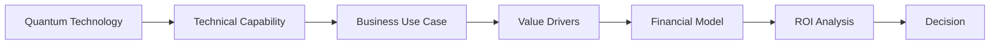

This creates a consistent path from technology potential to business analysis.

---

# 3. Problem Statement

A quantum initiative can appear attractive while still failing to produce a viable business case.

For example:

```text
Technology opportunity
        ↓
Potential performance improvement
        ↓
Operational impact
        ↓
Financial impact
        ↓
Investment required
        ↓
Risk adjustment
        ↓
ROI
```

The difficulty is that every step contains uncertainty.

A serious ROI platform therefore needs to make assumptions visible rather than hiding them inside a single score.

Quantum ROI Business is designed around this principle:

> **Every major ROI result should be traceable to an assumption, a value driver, a cost driver, or an evidence source.**

---

# 4. Product Vision

The long-term vision is to create a **business operating layer for quantum technology decisions**.

Instead of asking:

> "Is quantum computing valuable?"

the platform reframes the question:

> "Under what conditions does this specific quantum initiative create measurable business value?"

That distinction is fundamental.

Different organizations have different:

* processes
* cost structures
* revenue models
* risk tolerances
* technical capabilities
* capital constraints
* strategic priorities
* time horizons

Therefore, Quantum ROI Business is not intended to generate one universal quantum ROI number.

It is designed to generate a transparent model.

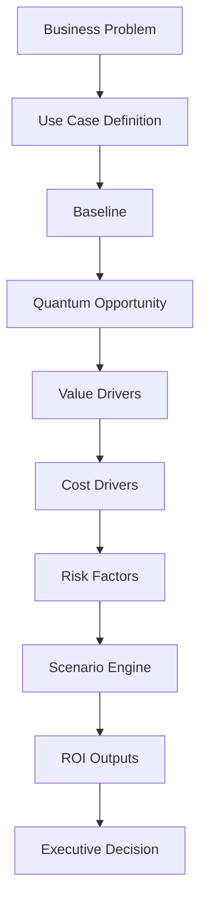

---

# 5. Core Capabilities

The platform can be conceptualized around several major capabilities.

## Business case construction

Users define the opportunity being evaluated.

Typical dimensions include:

* business unit
* use case
* operational process
* current baseline
* expected quantum-enabled improvement
* implementation horizon
* investment requirement
* operating cost
* expected benefits

## ROI analysis

The system translates those assumptions into:

* total investment
* annual benefit
* net benefit
* ROI
* payback period
* break-even point
* cumulative value

## Scenario analysis

Users can compare assumptions such as:

```text
Conservative
Base
Optimistic
```

without rebuilding the entire model.

## Sensitivity analysis

The platform can examine how results change when important assumptions move.

## Risk analysis

The model can distinguish between:

```text
expected financial value
risk-adjusted financial value
strategic value
non-financial value
```

## Executive visualization

Complex model outputs can be transformed into:

* KPI cards
* charts
* scenario comparisons
* value-driver breakdowns
* cost breakdowns
* risk indicators
* decision summaries

---

# 6. Primary User Journey

A typical workflow can be represented as follows:

```mermaid
flowchart LR
    A[Start] --> B[Create Business Case]
    B --> C[Define Use Case]
    C --> D[Enter Baseline]
    D --> E[Define Quantum Impact]
    E --> F[Estimate Costs]
    F --> G[Estimate Benefits]
    G --> H[Configure Risk]
    H --> I[Run Scenarios]
    I --> J[Review ROI]
    J --> K[Analyze Sensitivity]
    K --> L[Generate Decision Summary]
```

A user should not need to understand every quantum computing concept to use the business layer.

The interface should progressively expose complexity.

### Level 1 — Executive

```text
Expected ROI
Payback
Investment
Annual Benefit
Risk-adjusted Value
```

### Level 2 — Business Analyst

```text
Revenue Drivers
Cost Drivers
Operational Metrics
Scenario Assumptions
Sensitivity
```

### Level 3 — Technical / Quantum Analyst

```text
Algorithm assumptions
Technical constraints
Quantum resource assumptions
Hybrid architecture
Technology maturity
Implementation complexity
```

---

# 7. System Architecture

The platform should be understood as a layered decision system.

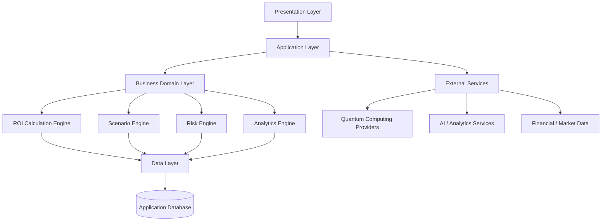

The architecture deliberately separates presentation from calculation logic.

This makes it possible to change the UI without changing the underlying ROI model.

---

# 8. Application Architecture

A clean application architecture can be represented using four major zones.

```text
┌─────────────────────────────────────────────┐
│              PRESENTATION                   │
│                                             │
│ Dashboard / Forms / Charts / Reports        │
└──────────────────┬──────────────────────────┘
                   │
┌──────────────────▼──────────────────────────┐
│              APPLICATION                    │
│                                             │
│ Business Cases / Workflows / Commands       │
└──────────────────┬──────────────────────────┘
                   │
┌──────────────────▼──────────────────────────┐
│                DOMAIN                       │
│                                             │
│ ROI / Costs / Benefits / Risk / Scenarios   │
└──────────────────┬──────────────────────────┘
                   │
┌──────────────────▼──────────────────────────┐
│                 DATA                        │
│                                             │
│ Persistence / APIs / External Services      │
└─────────────────────────────────────────────┘
```

The most important architectural rule is:

> Financial calculations should not depend on presentation components.

For example, a calculation should ideally be usable from:

```text
Dashboard
API
CLI
Automated test
Report generator
Export workflow
```

without duplicating the formula.

---

# 9. Domain Model

The core domain can be modeled around a business case.

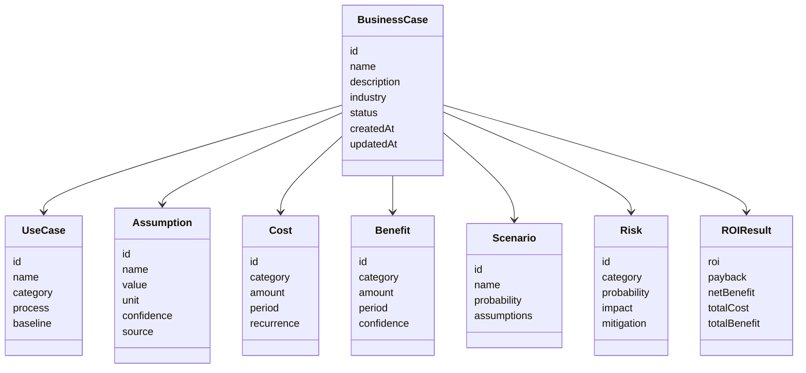

---

# 10. ROI Engine

The ROI engine is the financial core of the application.

A simplified ROI model can be expressed as:

```text
Net Benefit = Total Benefit - Total Cost
```

and:

```text
ROI = Net Benefit / Total Cost
```

When represented as a percentage:

```text
ROI % = (Net Benefit / Total Cost) × 100
```

For example:

```text
Total Benefit = $1,000,000
Total Cost    = $400,000

Net Benefit = $600,000

ROI = 600,000 / 400,000
    = 1.5

ROI % = 150%
```

The README intentionally presents the equation rather than embedding an assumed business result.

---

## ROI calculation pipeline

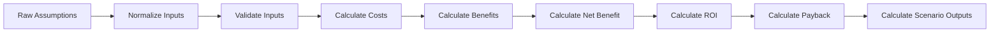

---

# 11. Quantum Business Model

Quantum ROI Business should separate **technical quantum capability** from **business value**.

A useful structure is:

```text
Quantum Capability
        ↓
Performance Improvement
        ↓
Operational Improvement
        ↓
Business Metric
        ↓
Financial Translation
```

For example, conceptually:

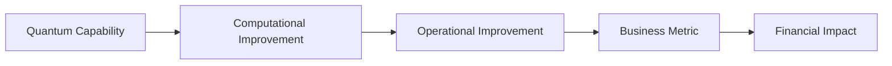

The system should avoid the simplistic assumption:

```text
quantum = faster = valuable
```

Instead, it should evaluate whether improved computation actually affects a business constraint.

---

# 12. Scenario Modeling

Scenario modeling allows a business case to represent uncertainty.

Typical scenarios:

```text
Conservative
Base
Upside
```

Each scenario can have independent assumptions.

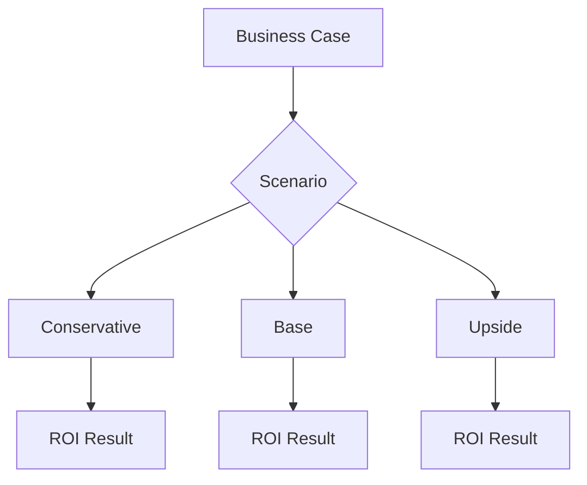

A scenario can modify:

```text
implementation cost
quantum performance
adoption rate
revenue impact
cost savings
time to deployment
operating expense
risk
```

---

## Scenario object

Conceptual example:

```json
{
  "name": "Base",
  "assumptions": {
    "implementationCost": 500000,
    "annualBenefit": 850000,
    "adoptionRate": 0.65,
    "timeToValueMonths": 18
  }
}
```

The exact persistence format should follow the application's actual data layer.

---

# 13. Financial Modeling

A robust business case should distinguish:

### One-time costs

```text
Research
Development
Integration
Consulting
Infrastructure setup
Training
Migration
```

### Recurring costs

```text
Cloud compute
Quantum execution
Software
Infrastructure
Support
Personnel
Maintenance
```

### Benefits

```text
Revenue increase
Cost reduction
Productivity
Reduced waste
Faster decisions
Risk reduction
Asset utilization
```

This separation matters because one-time and recurring economics behave differently.

---

# 14. Use-Case Evaluation

Potential quantum business opportunities can be organized by problem class.

## Optimization

Examples of generic business problems include:

```text
routing
scheduling
resource allocation
portfolio construction
supply planning
network design
```

## Simulation

Potential domains include:

```text
materials
chemistry
molecular modeling
manufacturing
energy systems
```

## Machine Learning

Possible categories include:

```text
classification
prediction
optimization-assisted ML
pattern recognition
```

## Security

Possible business cases include:

```text
cryptographic migration
post-quantum readiness
security architecture
long-term data protection
```

The platform should treat these categories as **use-case families**, not guaranteed sources of business value.

---

# 15. Value Driver Framework

A useful business case decomposes value into drivers.

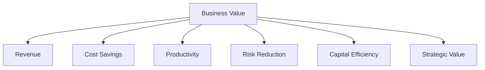

Each driver should have:

```text
name
description
baseline
expected change
unit
financial conversion
confidence
evidence
```

For example:

```json
{
  "driver": "Processing Cost",
  "baseline": 1000000,
  "expectedReduction": 0.2,
  "currency": "USD",
  "confidence": 0.75
}
```

---

# 16. Cost Modeling

Cost modeling should use a transparent hierarchy.

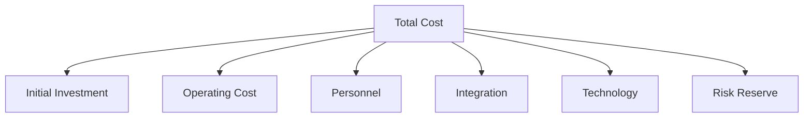

## Initial investment

Could include:

```text
architecture
engineering
proof of concept
consulting
data preparation
integration
training
```

## Technology cost

Potential inputs:

```text
cloud
quantum provider usage
simulation
storage
networking
software licensing
```

## People cost

Potential inputs:

```text
quantum researchers
software engineers
data scientists
business analysts
product managers
security specialists
```

---

# 17. Benefit Modeling

Benefits should be separated into measurable and non-financial categories.

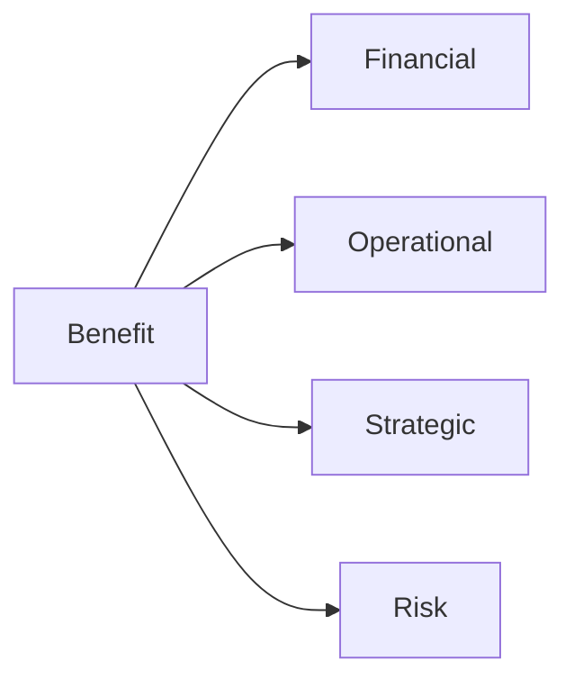

## Financial benefit

Examples:

```text
revenue
gross margin
cost savings
working capital
```

## Operational benefit

Examples:

```text
time saved
throughput
quality
service levels
```

## Strategic benefit

Examples:

```text
new capability
market differentiation
research advantage
future readiness
```

## Risk benefit

Examples:

```text
reduced operational risk
security exposure reduction
resilience
```

Not every benefit should be artificially converted into currency.

A mature model can maintain separate fields for:

```text
quantified benefit
qualitative benefit
confidence
evidence
```

---

# 18. Risk Modeling

Every ROI model contains uncertainty.

The risk layer should explicitly model:

```text
technology risk
execution risk
adoption risk
financial risk
market risk
data risk
integration risk
regulatory risk
```

A basic risk representation:

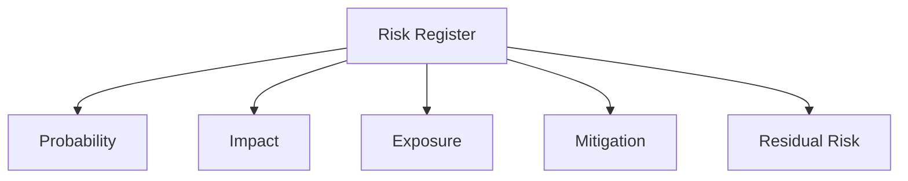

Conceptually:

```text
Risk Exposure = Probability × Impact
```

For example:

```json
{
  "risk": "Integration delay",
  "probability": 0.35,
  "impact": 250000,
  "mitigation": "Phased integration",
  "owner": "Program Team"
}
```

---

# 19. Opportunity Scoring

A business-case platform can include an opportunity framework without replacing the actual financial model.

Potential dimensions:

```text
Economic Value
Technical Feasibility
Time to Value
Strategic Alignment
Data Readiness
Organizational Readiness
Technology Maturity
Execution Complexity
```

These should remain separate from ROI.

A high strategic value does not automatically mean a high financial ROI.

This distinction improves analytical transparency.

---

# 20. Sensitivity Analysis

Sensitivity analysis answers:

> Which assumptions matter most?

Suppose:

```text
Implementation Cost
Quantum Advantage
Adoption Rate
Annual Savings
Time to Deployment
```

are the main inputs.

The engine can perturb each variable and observe the change in output.

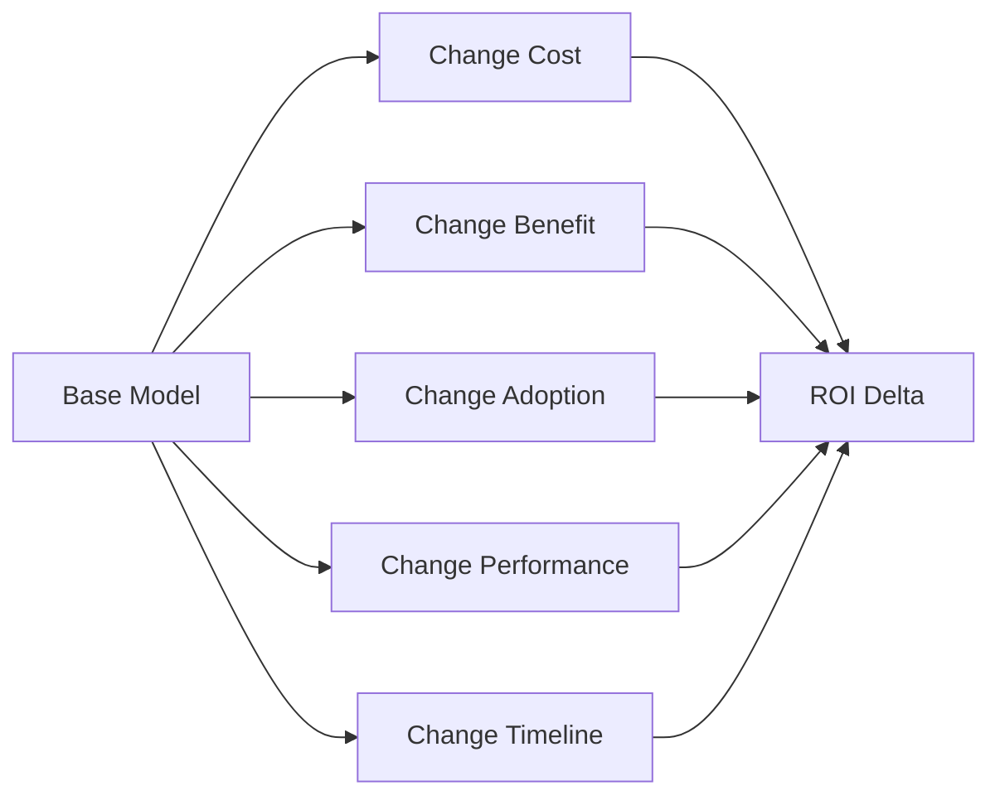

A future visualization can use a tornado chart:

```text
Impact on ROI
────────────────────────────────────

Annual Benefit       █████████████████
Implementation Cost  ████████████
Adoption Rate        █████████
Time to Value        ██████
Operating Cost       ████
```

---

# 21. Decision Workflow

Quantum ROI Business should help users move from analysis to a documented decision.

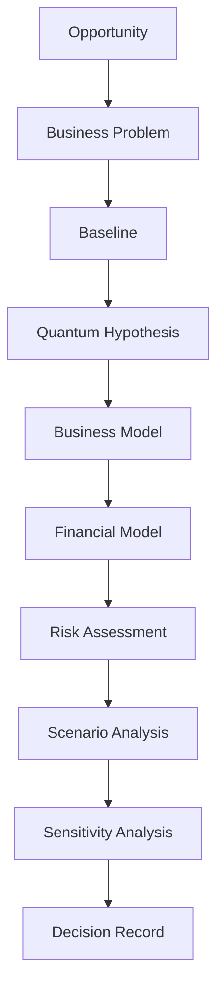

Possible decision states:

```text
Draft
Researching
Pilot Candidate
Pilot Active
Validated
Scale Candidate
Paused
Rejected
Archived
```

These are workflow states, not claims about whether an opportunity is good or bad.

---

# 22. Dashboard Design

The dashboard should prioritize decision-relevant information.

Recommended top-level layout:

```text
┌─────────────────────────────────────────────────────┐
│                 QUANTUM ROI BUSINESS                │
├─────────────────────────────────────────────────────┤
│ ROI        Payback      Investment      Benefit     │
│ 148%       19 mo        $500K           $1.24M      │
├─────────────────────────────────────────────────────┤
│                                                     │
│             VALUE OVER TIME                         │
│                                                     │
│       ╱───────────────                              │
│     ╱                                                   │
│  ──╯──────────────────────────                       │
│                                                     │
├────────────────────┬────────────────────────────────┤
│ COST BREAKDOWN     │ BENEFIT BREAKDOWN              │
│                    │                                │
│ Engineering  35%   │ Revenue        42%             │
│ Platform     25%   │ Savings        38%             │
│ Data         20%   │ Productivity   20%             │
│ Other        20%   │ Other           10%             │
├────────────────────┴────────────────────────────────┤
│ SCENARIOS                                            │
│ Conservative │ Base │ Upside                         │
└─────────────────────────────────────────────────────┘
```

Numbers shown in this diagram are illustrative layout values only.

---

# 23. Data Architecture

The logical data architecture can be represented as:

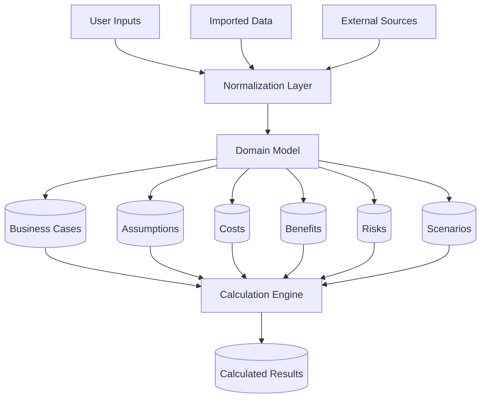

A critical principle:

> Raw assumptions and calculated outputs should remain distinguishable.

This makes models easier to audit.

---

# 24. Analytics Pipeline

Analytics processing can follow the pipeline:

```text
Input
  ↓
Validation
  ↓
Normalization
  ↓
Calculation
  ↓
Aggregation
  ↓
Scenario Simulation
  ↓
Risk Adjustment
  ↓
Visualization
  ↓
Export
```

Detailed architecture:

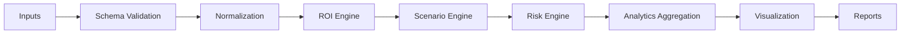

---

# 25. API Architecture

The application can expose a service-oriented API around business cases.

Conceptual endpoints:

```text
GET    /api/business-cases
POST   /api/business-cases
GET    /api/business-cases/:id
PUT    /api/business-cases/:id
DELETE /api/business-cases/:id
```

ROI:

```text
POST /api/roi/calculate
POST /api/roi/scenario
POST /api/roi/sensitivity
```

Analysis:

```text
GET /api/business-cases/:id/analytics
GET /api/business-cases/:id/scenarios
GET /api/business-cases/:id/risks
```

Reports:

```text
POST /api/reports
GET  /api/reports/:id
```

The exact route implementation should match the actual repository backend.

---

# 26. API Request Lifecycle

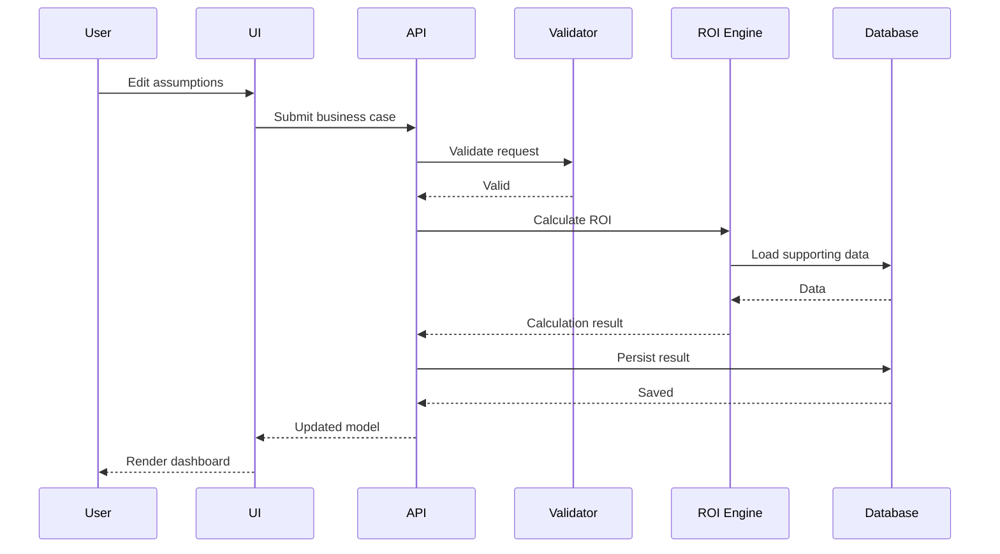

---

# 27. State Management

Application state can be separated into categories.

## UI state

```text
modal visibility
selected tab
chart filters
active scenario
loading
errors
```

## Business state

```text
business case
assumptions
costs
benefits
risks
scenarios
```

## Derived state

```text
ROI
payback
net benefit
annual benefit
break-even
risk-adjusted value
```

Derived values should preferably be calculated from canonical state rather than manually duplicated.

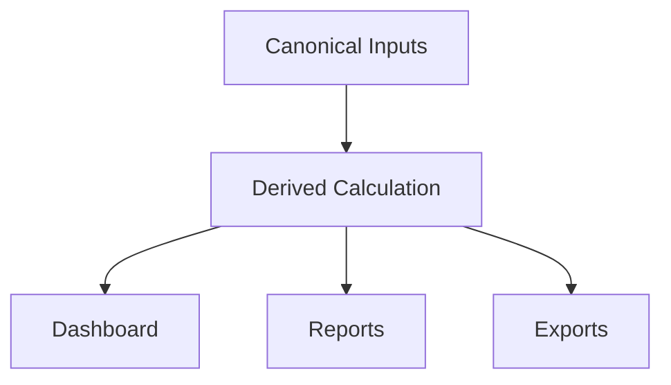

---

# 28. Security

Even a prototype ROI application can contain sensitive business information.

Potential sensitive data includes:

```text
financial assumptions
company strategy
investment plans
customer economics
internal cost structures
technology roadmaps
```

Security architecture should therefore consider:

```text
authentication
authorization
session management
secure transport
secret management
input validation
audit logs
rate limiting
```

---

## Authentication

A future production implementation can support:

```text
Email authentication
Single Sign-On
OAuth
Enterprise identity providers
```

---

## Authorization

Potential roles:

```text
Owner
Administrator
Analyst
Viewer
Auditor
```

Example:

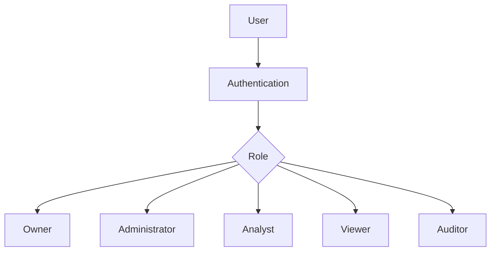

---

# 29. Privacy

The platform should follow data minimization principles.

The system should only collect the information needed to:

```text
create
calculate
store
analyze
export
```

a business case.

Privacy considerations include:

* encryption in transit
* encryption at rest
* access controls
* auditability
* configurable data retention
* deletion mechanisms
* separation of tenant data

---

# 30. Observability

Production deployments should make system behavior observable.

Three major pillars:

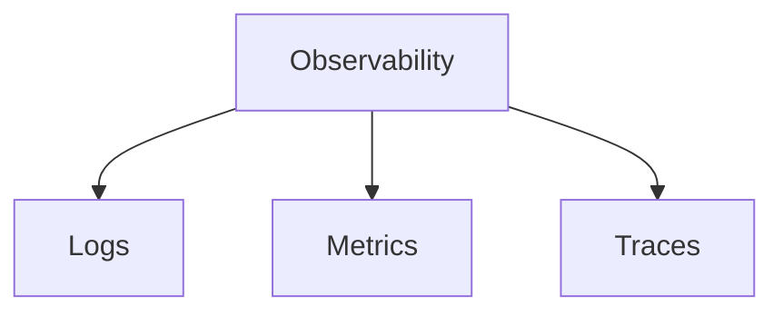

## Application metrics

Potential metrics:

```text
API latency
calculation latency
error rate
request volume
scenario calculations
report generation time
database query latency
```

## Business metrics

Potential metrics:

```text
active business cases
average scenario count
number of completed analyses
ROI model revisions
report exports
```

---

# 31. Performance

The ROI engine should remain computationally inexpensive for ordinary models.

For larger scenario sets, calculations can be structured as:

```mermaid
flowchart LR
    A[Base Model] --> B[Scenario Generator]
    B --> C[Parallel Calculations]
    C --> D[Result Aggregation]
    D --> E[Visualization]
```

Performance strategies include:

```text
memoization
result caching
incremental calculations
batch scenario processing
database indexing
lazy loading
pagination
virtualized tables
```

---

# 32. Error Handling

Error states should be understandable.

Instead of:

```text
Error 500
```

the application should provide:

```text
Unable to calculate ROI

The model is missing:
• implementation cost
• annual benefit
• calculation period
```

Errors should be categorized.

```text
VALIDATION_ERROR
AUTHENTICATION_ERROR
AUTHORIZATION_ERROR
CALCULATION_ERROR
DATA_ERROR
NETWORK_ERROR
EXTERNAL_SERVICE_ERROR
UNKNOWN_ERROR
```

---

# 33. Testing Strategy

A financial application requires deterministic testing.

Testing layers:

```mermaid
flowchart TD
    A[Testing] --> B[Unit]
    A --> C[Integration]
    A --> D[API]
    A --> E[UI]
    A --> F[End-to-End]
    A --> G[Regression]
```

---

## Unit testing

Focus heavily on:

```text
ROI calculations
payback
net benefit
scenario transformations
risk calculations
financial normalization
validation
```

For example:

```text
Given:
cost = 100
benefit = 200

Expected:
net benefit = 100
ROI = 100%
```

---

## Scenario testing

Test:

```text
positive ROI
zero ROI
negative ROI
zero cost
missing values
negative inputs
extreme values
multiple scenarios
```

---

# 34. Quality Assurance

Financial UI errors can be especially damaging because visually polished incorrect calculations can appear credible.

QA should therefore verify:

```text
formulas
rounding
currency formatting
decimal precision
date handling
scenario consistency
chart values
export values
dashboard values
```

The same model should produce consistent values across:

```text
Dashboard
Detail view
Report
API
Export
```

---

# 35. Deployment Architecture

A conceptual production topology:

```mermaid
flowchart TB

    USER[User]
    USER --> CDN[CDN / Edge]

    CDN --> WEB[Web Application]

    WEB --> API[Application API]

    API --> DB[(Primary Database)]

    API --> CACHE[(Cache)]

    API --> STORAGE[(Object Storage)]

    API --> EXT[External Services]

    EXT --> Q[Quantum Providers]
    EXT --> AI[AI Services]
```

This design allows the application to evolve from a prototype into a production service.

---

# 36. Environment Configuration

Environment configuration should distinguish development, staging, and production.

```text
.env.local
.env.development
.env.staging
.env.production
```

Potential variables:

```bash
APP_ENV=
API_BASE_URL=
DATABASE_URL=
AUTH_SECRET=
STORAGE_BUCKET=
AI_PROVIDER=
QUANTUM_PROVIDER=
LOG_LEVEL=
```

Secrets should never be committed directly to source control.

---

# 37. CI/CD

A production CI/CD workflow can follow:

```mermaid
flowchart LR
    A[Git Push] --> B[Lint]
    B --> C[Type Check]
    C --> D[Unit Tests]
    D --> E[Build]
    E --> F[Integration Tests]
    F --> G[Security Checks]
    G --> H[Deploy Staging]
    H --> I[Smoke Tests]
    I --> J[Production]
```

Pull requests should ideally require:

```text
successful build
passing tests
lint success
type validation
review
```

before production deployment.

---

# 38. Developer Workflow

Recommended development lifecycle:

```text
1. Create branch
2. Define change
3. Implement
4. Run local checks
5. Add tests
6. Review
7. Open pull request
8. CI validation
9. Merge
10. Deploy
```

Suggested branches:

```text
main
develop
feature/*
fix/*
refactor/*
docs/*
```

---

# 39. Project Structure

Because the exact repository tree was not available for inspection, the following is a **logical architecture rather than a claim about the current tree**.

```text
quantum-roi-business/
│
├── README.md
│
├── app/
│   ├── components/
│   ├── pages/
│   ├── layouts/
│   ├── forms/
│   └── dashboard/
│
├── domain/
│   ├── roi/
│   ├── scenarios/
│   ├── risks/
│   ├── benefits/
│   └── costs/
│
├── services/
│   ├── api/
│   ├── analytics/
│   ├── reporting/
│   └── integrations/
│
├── data/
│   ├── models/
│   ├── repositories/
│   └── fixtures/
│
├── tests/
│   ├── unit/
│   ├── integration/
│   └── e2e/
│
├── docs/
│   ├── architecture/
│   ├── product/
│   └── decisions/
│
└── scripts/
```

The actual repository structure should supersede this logical organization.

---

# 40. Extensibility

Quantum ROI Business should be designed around pluggable calculation modules.

```mermaid
flowchart TD
    CORE[Core ROI Engine]

    CORE --> O[Optimization Model]
    CORE --> S[Simulation Model]
    CORE --> ML[Quantum ML Model]
    CORE --> SEC[Security Model]
    CORE --> CUSTOM[Custom Model]
```

This allows specialized business cases without rewriting the entire platform.

---

# 41. Example ROI Model

Consider an illustrative business case.

```text
Initial investment:
$500,000

Annual operating cost:
$150,000

Annual business benefit:
$500,000
```

Annual net value:

```text
$500,000 - $150,000
= $350,000
```

A simplified first-year net contribution after initial investment:

```text
$350,000 - $500,000
= -$150,000
```

This illustrates why looking only at annual benefit is insufficient.

The analysis should include the full timeline.

---

## Multi-year representation

```text
Year 0
Investment
   │
   ▼
Year 1
Benefits - Operating Costs
   │
   ▼
Year 2
Benefits - Operating Costs
   │
   ▼
Year 3
Benefits - Operating Costs
```

---

# 42. Example Business Scenario

A hypothetical enterprise is evaluating quantum optimization for a complex planning problem.

### Baseline

```text
Current annual process cost:      $2,000,000
Current processing time:          30 hours
Annual decision volume:           250
```

### Proposed future state

```text
Target process cost:              $1,500,000
Target processing time:           10 hours
```

The value model can then separate:

```text
direct cost savings
time savings
increased decision frequency
potential revenue effects
implementation cost
ongoing infrastructure
```

The platform should not automatically assume all theoretical improvements become realized financial value.

Instead:

```mermaid
flowchart LR
    A[Technical Improvement]
    A --> B[Operational Potential]
    B --> C[Adoption Factor]
    C --> D[Realized Improvement]
    D --> E[Financial Value]
```

---

# 43. Technical Decision Records

Large systems benefit from documenting important architecture decisions.

Example ADR format:

```markdown
# ADR-001: Separate ROI Calculation from UI

## Status

Accepted

## Context

Financial calculations need to be reused across multiple interfaces.

## Decision

ROI calculations are implemented as domain-level functionality rather
than UI-specific logic.

## Consequences

Positive:
- easier testing
- reusable calculations
- consistent results

Negative:
- additional abstraction
- domain interfaces need maintenance
```

Other useful ADR topics:

```text
ADR-002: Scenario architecture
ADR-003: Data validation strategy
ADR-004: External provider abstraction
ADR-005: Authentication architecture
ADR-006: Reporting architecture
ADR-007: Calculation precision
```

---

# 44. Design Principles

## Principle 1 — Explain the number

Every major KPI should have a path back to its inputs.

```text
ROI
 ↓
Net Benefit
 ↓
Benefits - Costs
 ↓
Drivers
 ↓
Assumptions
```

---

## Principle 2 — Separate assumptions from facts

The system should differentiate:

```text
observed
estimated
modeled
projected
scenario-based
```

---

## Principle 3 — Preserve uncertainty

Avoid turning uncertain inputs into false precision.

For example:

```text
Expected benefit: $5M
Confidence: Medium
```

can be more informative than:

```text
Expected benefit: $5,037,291.47
```

when the underlying data is highly uncertain.

---

## Principle 4 — Make scenarios first-class

Users should be able to see how conclusions change under different assumptions.

---

## Principle 5 — Keep business and technical views connected

The application should never require users to choose between:

```text
technical depth
```

and:

```text
business clarity
```

It should provide both at the appropriate level.

---

# 45. Troubleshooting

## ROI result is blank

Check:

```text
required assumptions
cost inputs
benefit inputs
calculation period
scenario selection
validation errors
```

---

## Scenario does not update

Check:

```text
scenario ID
assumption mapping
calculation cache
state synchronization
API response
```

---

## Dashboard values differ from detail view

The application should have one canonical calculation engine.

Investigate:

```text
duplicated formulas
rounding
currency conversion
stale state
cached results
```

---

## Charts do not match the ROI model

Verify that charts are consuming calculated domain outputs rather than independently recreating formulas.

Preferred architecture:

```text
ROI Engine
   ↓
Canonical Results
   ↓
Charts
```

Not:

```text
ROI Engine ──→ KPI
Chart Logic ──→ Chart
API Logic ────→ Report
```

with each independently calculating the values.

---

# 46. FAQ

## What is Quantum ROI Business?

Quantum ROI Business is a framework for modeling and communicating the business value of quantum-computing initiatives.

## Is this a quantum computer simulator?

Not necessarily.

The primary focus is business-case modeling rather than replacing quantum hardware or quantum SDKs.

## Can it model non-quantum projects?

The underlying ROI methodology can be generalized to other technology investments, although the platform is oriented around quantum use cases.

## What is the most important output?

There is no single universally sufficient metric.

Useful outputs include:

```text
ROI
Net Benefit
Payback
Investment
Annual Benefit
Risk
Sensitivity
Scenario Range
```

## Why are scenarios important?

Because projections are based on assumptions, and different assumptions can produce materially different results.

## Can AI be added?

Yes.

AI can support:

```text
assumption extraction
business-case drafting
scenario generation
natural-language explanations
report generation
use-case discovery
```

AI outputs should remain distinguishable from deterministic financial calculations.

---

# 47. Contributing

Contributions should preserve the project's separation between:

```text
presentation
application
domain
data
```

## Suggested contribution process

```text
Fork
  ↓
Create branch
  ↓
Implement change
  ↓
Add tests
  ↓
Update documentation
  ↓
Run validation
  ↓
Open pull request
```

A contribution should ideally explain:

```text
What changed?
Why?
What problem does it solve?
How was it tested?
Does it affect calculations?
Does it affect data structures?
```

---

# 48. Documentation

Recommended documentation structure:

```text
docs/
├── README.md
├── architecture/
│   ├── system.md
│   ├── data.md
│   ├── roi-engine.md
│   └── integrations.md
│
├── product/
│   ├── business-cases.md
│   ├── scenarios.md
│   ├── risk.md
│   └── reporting.md
│
├── engineering/
│   ├── development.md
│   ├── testing.md
│   ├── deployment.md
│   └── security.md
│
└── decisions/
    ├── ADR-001.md
    ├── ADR-002.md
    └── ADR-003.md
```

---

# 49. Project Status

The project can be tracked through a maturity model.

```text
┌─────────────────────────────────────────────────┐
│                 PRODUCT MATURITY                │
├─────────────────────────────────────────────────┤
│                                                 │
│ Idea                                             │
│   ↓                                             │
│ Prototype                                        │
│   ↓                                             │
│ Functional MVP                                   │
│   ↓                                             │
│ Analytics Platform                               │
│   ↓                                             │
│ Production                                       │
│   ↓                                             │
│ Enterprise Platform                              │
│                                                 │
└─────────────────────────────────────────────────┘
```

Potential future milestones:

```text
[ ] Business-case editor
[ ] ROI calculation engine
[ ] Scenario engine
[ ] Risk analysis
[ ] Sensitivity analysis
[ ] Executive dashboard
[ ] Report export
[ ] Team collaboration
[ ] Authentication
[ ] Audit history
[ ] External quantum integrations
[ ] AI-assisted analysis
[ ] Enterprise controls
```

The checklist should be synchronized with the actual repository state.

---

# 50. License

Add the repository's actual license here.

Example:

```text
This project is licensed under the MIT License.
See LICENSE for details.
```

Do not claim a license that is not actually included in the repository.

---

# Architecture Summary

The entire platform can be represented by the following end-to-end diagram:

```mermaid
flowchart TB

    USER[Business User]

    USER --> UI[Quantum ROI Business Interface]

    UI --> CASE[Business Case]

    CASE --> BASE[Baseline Model]
    CASE --> ASSUME[Assumptions]
    CASE --> COST[Cost Model]
    CASE --> BENEFIT[Benefit Model]
    CASE --> RISK[Risk Model]
    CASE --> SCENARIO[Scenario Model]

    BASE --> ENGINE[ROI Engine]
    ASSUME --> ENGINE
    COST --> ENGINE
    BENEFIT --> ENGINE
    RISK --> ENGINE
    SCENARIO --> ENGINE

    ENGINE --> ROI[ROI]
    ENGINE --> PAYBACK[Payback]
    ENGINE --> VALUE[Net Benefit]
    ENGINE --> SENS[Sensitivity]
    ENGINE --> RANGE[Scenario Range]

    ROI --> DASH[Executive Dashboard]
    PAYBACK --> DASH
    VALUE --> DASH
    SENS --> DASH
    RANGE --> DASH

    DASH --> REPORT[Reports / Exports]

    ENGINE --> AUDIT[Audit / Calculation History]

    ENGINE --> EXT[External Data / Providers]

    EXT --> QUANTUM[Quantum Computing Services]
    EXT --> AI[AI / Intelligence]
    EXT --> DATA[Business Data]
```

---

# End-to-End Data Flow

```mermaid
sequenceDiagram

    participant User
    participant App
    participant Model
    participant ROI
    participant Scenario
    participant Risk
    participant Dashboard

    User->>App: Create business case

    App->>Model: Store baseline

    User->>App: Define assumptions

    App->>Model: Store assumptions

    User->>App: Define costs and benefits

    App->>ROI: Calculate base model

    ROI-->>App: ROI + payback + net benefit

    User->>App: Create scenarios

    App->>Scenario: Run scenario calculations

    Scenario-->>App: Scenario results

    User->>App: Run risk analysis

    App->>Risk: Evaluate exposure

    Risk-->>App: Risk-adjusted results

    App->>Dashboard: Aggregate results

    Dashboard-->>User: Visual business case
```

---

# Conceptual Data Model

```mermaid
erDiagram

    BUSINESS_CASE ||--o{ ASSUMPTION : contains
    BUSINESS_CASE ||--o{ COST : contains
    BUSINESS_CASE ||--o{ BENEFIT : contains
    BUSINESS_CASE ||--o{ RISK : contains
    BUSINESS_CASE ||--o{ SCENARIO : contains
    BUSINESS_CASE ||--o{ USE_CASE : evaluates

    SCENARIO ||--o{ SCENARIO_ASSUMPTION : overrides
    ASSUMPTION ||--o{ SCENARIO_ASSUMPTION : appears_in

    BUSINESS_CASE ||--o{ ROI_RESULT : generates

    BUSINESS_CASE {
        string id
        string name
        string description
        string status
        datetime created_at
        datetime updated_at
    }

    ASSUMPTION {
        string id
        string business_case_id
        string name
        float value
        string unit
        string confidence
    }

    COST {
        string id
        string business_case_id
        string category
        float amount
        string period
    }

    BENEFIT {
        string id
        string business_case_id
        string category
        float amount
        string period
    }

    RISK {
        string id
        string business_case_id
        string category
        float probability
        float impact
    }

    SCENARIO {
        string id
        string business_case_id
        string name
        float probability
    }

    ROI_RESULT {
        string id
        string business_case_id
        float roi
        float net_benefit
        float payback
    }
```

---

# ROI Calculation Architecture

```mermaid
flowchart TD

    INPUTS[Business Inputs]

    INPUTS --> VALIDATE[Validation]
    VALIDATE --> NORMALIZE[Normalization]

    NORMALIZE --> COSTS[Cost Aggregator]
    NORMALIZE --> BENEFITS[Benefit Aggregator]

    COSTS --> TOTALCOST[Total Cost]
    BENEFITS --> TOTALBENEFIT[Total Benefit]

    TOTALCOST --> NET[Net Benefit]
    TOTALBENEFIT --> NET

    NET --> ROI[ROI]

    TOTALCOST --> PAYBACK[Payback]
    TOTALBENEFIT --> PAYBACK

    ROI --> SCENARIOS[Scenario Analysis]
    PAYBACK --> SCENARIOS

    SCENARIOS --> SENSITIVITY[Sensitivity Analysis]
    SENSITIVITY --> OUTPUTS[Decision Outputs]
```

---

# Risk-Adjusted Business Case

A more advanced architecture can introduce probability weighting.

```mermaid
flowchart LR

    A[Scenario A] --> P1[Probability]
    B[Scenario B] --> P2[Probability]
    C[Scenario C] --> P3[Probability]

    A --> V1[Scenario Value]
    B --> V2[Scenario Value]
    C --> V3[Scenario Value]

    P1 --> E[Expected Value]
    P2 --> E
    P3 --> E

    V1 --> E
    V2 --> E
    V3 --> E

    E --> DECISION[Decision Analysis]
```

A conceptual expected-value calculation:

```text
Expected Value =
    Scenario A Value × Probability A
  + Scenario B Value × Probability B
  + Scenario C Value × Probability C
```

This should be used carefully because assigning scenario probabilities itself involves assumptions.

---

# Executive View vs Analyst View

A major UX principle is progressive disclosure.

```mermaid
flowchart TB

    EXEC[Executive View]

    EXEC --> KPI[KPIs]
    EXEC --> DECISION[Decision Summary]
    EXEC --> RANGE[Scenario Range]

    ANALYST[Analyst View]

    ANALYST --> DRIVERS[Value Drivers]
    ANALYST --> COSTMODEL[Cost Model]
    ANALYST --> BENEFITMODEL[Benefit Model]
    ANALYST --> SENS[Sensitivity]

    TECH[Technical View]

    TECH --> PERFORMANCE[Performance Assumptions]
    TECH --> FEASIBILITY[Technical Feasibility]
    TECH --> INTEGRATION[Integration Complexity]

    EXEC --> ANALYST
    ANALYST --> TECH
```

This creates three levels of abstraction without creating three separate systems.

---

# Suggested Dashboard Information Hierarchy

```text
LEVEL 1
────────────────────────────────

Business Case Name

Expected ROI
Payback
Investment
Annual Benefit
Risk-adjusted Value


LEVEL 2
────────────────────────────────

Why?

Value Drivers
Cost Drivers
Scenario Comparison
Key Assumptions


LEVEL 3
────────────────────────────────

How?

Calculation Detail
Technical Assumptions
Sensitivity
Risk Register
Historical Versions
```

---

# Business Case Lifecycle

```mermaid
stateDiagram-v2

    [*] --> Draft

    Draft --> Analysis
    Analysis --> ScenarioModeling
    ScenarioModeling --> RiskReview
    RiskReview --> Decision

    Decision --> Pilot
    Decision --> Paused
    Decision --> Archived

    Pilot --> Validation
    Validation --> ScalePlanning
    ScalePlanning --> Production

    Production --> Monitoring
    Monitoring --> Reassessment

    Reassessment --> ScenarioModeling
    Reassessment --> Archived
```

This gives the application a path beyond a static calculator.

It becomes a system for managing technology investment decisions over time.

---

# Versioned Financial Models

One important future capability is model versioning.

Instead of overwriting:

```text
ROI = 150%
```

the platform can maintain:

```text
Version 1
ROI = 90%

Version 2
ROI = 120%

Version 3
ROI = 150%
```

This allows users to answer:

> Why did the business case change?

```mermaid
flowchart LR

    V1[Model v1] --> V2[Model v2]
    V2 --> V3[Model v3]
    V3 --> V4[Model v4]

    V1 --> A1[Assumptions]
    V2 --> A2[Changed Assumptions]
    V3 --> A3[New Evidence]
    V4 --> A4[Updated Forecast]
```

---

# Auditability

For financial decision systems, reproducibility is important.

A result should ideally have a trace:

```text
ROI
 ↓
Calculation ID
 ↓
Model Version
 ↓
Scenario
 ↓
Inputs
 ↓
Assumptions
 ↓
Source / Evidence
 ↓
Timestamp
```

This can be represented as:

```mermaid
flowchart TD
    R[ROI Result] --> C[Calculation ID]
    C --> V[Model Version]
    V --> S[Scenario]
    S --> I[Inputs]
    I --> A[Assumptions]
    A --> E[Evidence]
```

---

# AI Extension Architecture

An AI layer can be added without allowing AI to replace deterministic financial calculations.

```mermaid
flowchart TB

    USER[User]

    USER --> AI[AI Assistant]

    AI --> EXTRACT[Assumption Extraction]
    AI --> GENERATE[Scenario Suggestions]
    AI --> EXPLAIN[Result Explanation]
    AI --> REPORT[Report Generation]

    EXTRACT --> DOMAIN[Structured Domain Model]
    GENERATE --> DOMAIN

    DOMAIN --> ROI[Deterministic ROI Engine]

    ROI --> RESULTS[Verified Results]

    RESULTS --> EXPLAIN
    RESULTS --> REPORT
```

The important architectural distinction is:

```text
AI = interpretation / assistance

ROI engine = deterministic calculation
```

This prevents a language model from becoming the authority for financial arithmetic.

---

# Possible AI Features

Future AI functionality could include:

### Business-case assistant

```text
"Help me build a business case for quantum supply-chain optimization."
```

The assistant can guide the user toward:

```text
baseline
cost
benefit
implementation
risk
timeline
```

### Assumption extraction

A user could paste a document and receive structured candidate assumptions.

### Scenario generation

The system could propose:

```text
Conservative
Base
Upside
```

assumption sets.

### Executive explanation

Instead of presenting only:

```text
ROI: 137%
```

the system can explain:

```text
The modeled return is primarily driven by cost reduction,
while implementation cost and adoption rate are the largest
uncertainties.
```

The underlying calculations should remain deterministic.

---

# Integration Architecture

A provider abstraction can prevent vendor lock-in.

```mermaid
flowchart LR

    CORE[Quantum ROI Core]

    CORE --> ADAPTER[Provider Adapter Layer]

    ADAPTER --> IBM[Provider A]
    ADAPTER --> AWS[Provider B]
    ADAPTER --> GOOGLE[Provider C]
    ADAPTER --> OTHER[Provider D]
```

The same pattern can apply to AI providers.

```mermaid
flowchart LR

    AI_CORE[AI Gateway]

    AI_CORE --> PROVIDER_A[Model Provider A]
    AI_CORE --> PROVIDER_B[Model Provider B]
    AI_CORE --> PROVIDER_C[Model Provider C]
```

This architecture allows providers to change independently of the business domain.

---

# Export Architecture

Reports should derive from the same canonical calculation state.

```mermaid
flowchart TD

    MODEL[Canonical Business Model]

    MODEL --> DASH[Dashboard]
    MODEL --> PDF[PDF Report]
    MODEL --> CSV[CSV Export]
    MODEL --> XLSX[Spreadsheet Export]
    MODEL --> JSON[JSON Export]
    MODEL --> API[API Response]
```

This prevents inconsistent numbers between different outputs.

---

# Internationalization

A production business platform may eventually support:

```text
English
French
German
Spanish
Japanese
Korean
Chinese
```

Internationalization should cover more than labels.

It may also require:

```text
currency
number formatting
decimal separators
date formatting
timezone
unit systems
```

---

# Accessibility

The dashboard should be usable without relying exclusively on color.

Charts should provide:

```text
labels
legends
tooltips
accessible descriptions
```

Forms should support:

```text
keyboard navigation
focus states
semantic labels
error messages
screen-reader-compatible controls
```

A strong visual dashboard should remain understandable in grayscale.

---

# Mobile / Responsive Architecture

The application should progressively adapt to viewport size.

```text
Desktop
────────────────────────────────────────
Sidebar | Dashboard | Details | Charts


Tablet
────────────────────────────
Navigation
Dashboard
Charts
Details


Mobile
────────────────
Header
KPIs
Scenario
Value
Costs
Benefits
Details
```

Responsive design should prioritize information hierarchy rather than simply shrinking the desktop interface.

---

# Design System

A potential design language for Quantum ROI Business:

```text
Primary:
Quantum / Electric Blue

Secondary:
Violet / Purple

Positive:
Green

Warning:
Amber

Negative:
Red

Background:
Near Black / Midnight

Surface:
Dark Slate

Typography:
High-contrast modern sans serif
```

A white-background variant can also work for enterprise reporting.

The visual language should reinforce:

```text
precision
trust
technology
financial clarity
analytical depth
```

rather than relying on generic "futuristic" decoration.

---

# Recommended KPI Cards

```text
┌────────────────┐
│ EXPECTED ROI   │
│                │
│ 137%           │
│ ▲ vs baseline  │
└────────────────┘

┌────────────────┐
│ PAYBACK        │
│                │
│ 18 months      │
│                │
└────────────────┘

┌────────────────┐
│ INVESTMENT     │
│                │
│ $500K          │
│                │
└────────────────┘

┌────────────────┐
│ NET BENEFIT    │
│                │
│ $685K          │
│                │
└────────────────┘
```

Again, displayed numbers are illustrative examples rather than repository-specific results.

---

# Product Expansion

Quantum ROI Business can eventually evolve from:

```text
ROI Calculator
```

into:

```text
Quantum Investment Intelligence Platform
```

The progression could be:

```mermaid
flowchart LR
    A[ROI Calculator]
    --> B[Scenario Engine]
    --> C[Business Case Platform]
    --> D[Portfolio Management]
    --> E[Investment Intelligence]
```

---

# Portfolio Architecture

Once multiple business cases exist, a portfolio layer becomes possible.

```mermaid
flowchart TD

    PORTFOLIO[Quantum Portfolio]

    PORTFOLIO --> A[Use Case A]
    PORTFOLIO --> B[Use Case B]
    PORTFOLIO --> C[Use Case C]
    PORTFOLIO --> D[Use Case D]

    A --> R1[ROI]
    B --> R2[ROI]
    C --> R3[ROI]
    D --> R4[ROI]

    R1 --> P[Portfolio View]
    R2 --> P
    R3 --> P
    R4 --> P
```

Portfolio analytics could evaluate:

```text
total investment
total modeled benefit
risk concentration
technology concentration
business-unit concentration
timeline
```

---

# Decision Intelligence Layer

The ultimate architecture can be represented as:

```text
                 QUANTUM ROI BUSINESS
                         │
        ┌────────────────┼────────────────┐
        │                │                │
     FINANCE         TECHNOLOGY        STRATEGY
        │                │                │
    ROI/NPV          Feasibility      Alignment
    Payback          Performance      Priorities
    Costs            Maturity         Portfolio
        │                │                │
        └────────────────┼────────────────┘
                         │
                   DECISION MODEL
                         │
                         ▼
                  BUSINESS DECISION
```

This is the core product concept:

> translate quantum technology uncertainty into structured business decision information.

---

# Recommended Future Roadmap

## Phase 1 — Core Model

```text
Business cases
Cost model
Benefit model
ROI engine
Dashboard
```

## Phase 2 — Advanced Analytics

```text
Scenarios
Sensitivity
Risk
Versioning
Exports
```

## Phase 3 — Intelligence

```text
AI assistant
Document ingestion
Assumption extraction
Scenario generation
Natural-language explanations
```

## Phase 4 — Enterprise

```text
Organizations
RBAC
SSO
Audit trails
Portfolio management
Governance
```

## Phase 5 — Quantum Ecosystem

```text
Quantum provider integrations
Benchmark ingestion
Technology maturity tracking
Quantum-resource estimation
```

---

# Final Architecture

The complete conceptual system:

```mermaid
flowchart TB

    subgraph EXPERIENCE[Experience Layer]
        DASH[Executive Dashboard]
        ANALYST[Analyst Workspace]
        TECH[Technical Analysis]
        REPORTS[Reports]
    end

    subgraph APPLICATION[Application Layer]
        CASE[Business Case Management]
        WORKFLOW[Decision Workflow]
        USERS[Identity / Permissions]
    end

    subgraph DOMAIN[Domain Layer]
        ROI[ROI Engine]
        SCENARIO[Scenario Engine]
        RISK[Risk Engine]
        SENS[Sensitivity Engine]
        PORT[Portfolio Engine]
    end

    subgraph DATA[Data Layer]
        MODEL[Business Models]
        ASSUMPTIONS[Assumptions]
        COSTS[Costs]
        BENEFITS[Benefits]
        RISKS[Risks]
        RESULTS[Results]
    end

    subgraph INTEGRATION[Integration Layer]
        QP[Quantum Providers]
        AI[AI Providers]
        EXT[External Data]
    end

    EXPERIENCE --> APPLICATION
    APPLICATION --> DOMAIN
    DOMAIN --> DATA
    DOMAIN --> INTEGRATION
```

---

# Philosophy

Quantum ROI Business is built around one central idea:

```text
Quantum technology
        ↓
should not stop at
        ↓
technical capability
        ↓
it needs to connect to
        ↓
business value
        ↓
through explicit assumptions
        ↓
transparent calculations
        ↓
scenario analysis
        ↓
risk analysis
        ↓
decision intelligence
```

The platform therefore treats ROI not as a single number, but as a **traceable model of how technology could create business value under explicit assumptions**.

---

# Closing

Quantum ROI Business is intended to create a common language between:

```text
Quantum Researchers
        │
        ▼
Engineering Teams
        │
        ▼
Data / Analytics Teams
        │
        ▼
Business Leaders
        │
        ▼
Finance
        │
        ▼
Strategy
```

The result is a structured workflow for turning emerging quantum capabilities into business cases that can be modeled, challenged, compared, communicated, and continuously updated.

```text
┌─────────────────────────────────────────────────────┐
│                                                     │
│                 QUANTUM TECHNOLOGY                  │
│                         ↓                           │
│                 BUSINESS USE CASE                   │
│                         ↓                           │
│                  VALUE DRIVERS                      │
│                         ↓                           │
│                   COST MODEL                        │
│                         ↓                           │
│                  BENEFIT MODEL                      │
│                         ↓                           │
│                   RISK MODEL                        │
│                         ↓                           │
│                  SCENARIO MODEL                     │
│                         ↓                           │
│                 SENSITIVITY                         │
│                         ↓                           │
│                  ROI ENGINE                         │
│                         ↓                           │
│               DECISION INTELLIGENCE                 │
│                                                     │
└─────────────────────────────────────────────────────┘
```

## Quantum ROI Business

**Model the opportunity. Understand the assumptions. Quantify the value. Expose the uncertainty. Make the business case understandable.**

---

### Repository

`https://github.com/lucylow/quantum-roi-business`

### Documentation principle

> **The calculation engine should be deterministic, the assumptions should be visible, the scenarios should be explicit, and every important number should be explainable.**
